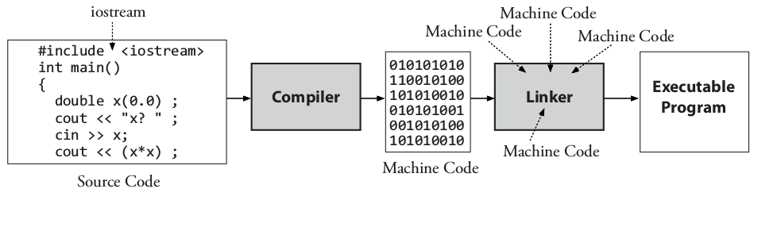

# 第2章 C++基础

**前章回顾**

在第1章中，我们介绍了在实际程序开发中常见的分析、设计、实现三步走策略，并鼓励大家在编写C++代码之前先做一些分析与设计。然而，对于本书中的很多问题来说，实际上往往并没有什么具体的分析和设计可做。通常，所谓的分析可能只是“阅读问题”，而设计也可能只是”在脑海中构思一个算法“。

**本章提要**

在这一章中，我们将重点介绍如何用C++编程语言将算法转换成程序。而我们所键入的这份源代码将作为输入被传递给编译器，由编译器将该源代码转换成我们指定计算机所能理解的机器码。当然，编译器会要求源代码必须遵循某种精确的编程语言规范。因此，如果要想理解算法的伪代码是如何被转换成等效的编程语言的，我们就必须要了解组成一个程序的最小零件，并知道如何正确地将它们组建成相关的语句。另外，本章也会介绍许多对象可以执行操作。我们希望在完成本章的学习之后，你将：

* 了解如何将现有的源代码纳入到自己的程序中。
* 学会从用户那里获取数据，并能将信息显示给用户。
* 学会创建算术表达式，并能对其进行求值。
* 了解初始化、输入、赋值以及输出等在许多对象上都通用的常见操作。
* 学会用C++编程语言来解决问题。

## 2.1 C++程序的零件

在原始状态下，C++程序不过只是存储在某种文件中的一段在字符序列而已，但这种文件的命名通常会以`.cc`、`.c`、`.cp`或`.cpp`结尾（譬如`first.cc`、`first.C`或`first.cpp`），以此来表示该文件是一段c++程序。而某些编程环境往往需要或假定用户遵循这套文件命名约定，所以当我们为将某个算法转换成与之等效的C++编程语言创建相关文件时，也务必要使用这种约定的扩展名来命名文件。

而对于文件中所包含的文本，我们接下来也要引入某种C++程序的*通用格式*，这种通用格式是用来描述*语法*（即语言使用规范）的，它也需要有符合编程语言结构的写法。和本书中其他所有地方一样，这种通用格式也将遵守以下约定：

1. 以`等宽字体`呈现的元素可被原样使用。这其中既包括`int main`、`cout`、`cin`这些关键字，也包括`<<`、`>>`这样的符号。
2. 以*倾斜字体*呈现的这部分通用格式将必须由程序员来负责提供具体内容，譬如*expression*表示程序员须在该处提供一个有效的表达式。
3. 以倾斜字体呈现的实体项代表它在别的地方已被定义。

**通用格式 2.1**：*标准C++程序*

```C++
// A comment
#include-directives
using namespace std;
int main() {
     *statements*
    return 0;
}
```

在上述通用格式中，以加粗字体显示的部分只需照原样编写即可。而*statements*所在的部分表示的是一个不同语句组成的集合。语句是程序所能执行的最小独立操作单元。事实上到目前为止，本章已经介绍到几条语句了。这里需要说明的是，虽然在C++标准中不是必须的，但本书的C++程序都会以`return 0；`结尾。另外，`main`函数的主体部分将会用一对花括号`{ }`框住，每个函数都有这样一个将其中所有代码视为一个整体的结构。

在进入更细节的讨论之前，我们先来看一段语法正确的标准C++程序。请以程序的形式运行一下这段代码，它必须要有一个名为`main`的函数。（*提示：*下面的`std`是standard的缩写。）

```C++
// This program prompts for a name and prints a friendly message
#include <iostream>   // For cout, cin, and endl
#include <string>     // for the string type

using namespace std;  // Allow programmers to write cin and cout
                      // rather than std::cin and std::cout
int main() {
    string name;
    cout << "What is your name: ";
    cin >> name;

    cout << "Hello " << name;

    cout << ", I hope you're feeling well." << endl;
    return 0;
}
```

**程序会话**

```shell
What is your name: ***Casey***
Hello Casey, I hope you’re feeling well.
```

这段源代码将会被输入到编译器中，由编译器将这些源代码转换成机器码。在这过程中，编译器有可能会产生出报错或警告信息。这些错误是编译器在扫描该程序的源代码，以及该程序所有`#include`文件中的附加源代码时被检测到的。例如在上述程序，我们在`int main()`之前引入了一个名为`iostream`的文件，因此该文件中的源代码也成为了这个程序的一部分。在这里，`#include`指令的作用就是用被`#include`文件的内容替换掉该指令所在的文本。

每个C++程序通常都会用到一两个以上的由其他程序员所提供的源码文件。事实上，C++编译器本身就提供了大量的源码文件。下面，我们就来看看将其他文件中的源码加入到自己程序中的通用格式：

**通用格式 2.2**：*`#include`指令*

`#include` <*include-file*>

——或——

`#include` "*include-file*"

在这里，`#include`和尖括号`< >`或双引号`" "`的部分都只需照原样编写即可，只有*include-file*必须是已经存在了的文件名。例如，我们在程序中加入以下`#include`指令，为的就是让其提供`cout`、`cin`和`endl`这三个对象：

```C++
#include <iostream>
```

但是，这个`#include`指令实际上为我们提供的是`std::cout`、`std::cin`和`std::endl`。C++标准库（`iostream`只是它的一部分）是定义一个叫做`std`的名字空间中的，为了避免频繁重复写`std::`，我们通常会在`#include <iostream>`以及其他`#include`指令后面加上下面这行代码：

```C++
using namespace std; // Can now write cout instead of std::cout
```

另外请注意，在`< >`或`" "`之间不能有任何空格。

```C++
#include <iostream > // ERROR, space at end
#include " BankAccount.h" // ERROR, space up front
```

通常，用尖括号`< >`所`#include`的文件应该必然属于系统的一部分，我们的系统应该可以自动遭到这些文件。而被双引号`" "`所`#include`的文件则往往需要被存储到包含它们的程序所在的相同目录中。

### 2.1.1 标记：一个程序的最小零件

在继续介绍对象初始化和语句的通用格式之前，我们希望先带读者来了解一下编程语言中那些用于构建起更大型结构的最小零件。这将有助于我们：

* 更容易在编码时写出语法正确的语句。
* 更好地了解应该如何修复被编译器检出的那些错误。
* 看懂通用格式。

C++编译器读取源代码的过程，实际上就是它在逐一识别其中各种*标记（token）*的过程。标记是一个程序中最小的可识别组件，我们可以将其分成以下四类：

| 标记分类 | 具体示例 |
|----------|---------|
| 特殊符号 | `; ( ) << >>` |
| 关键字 | `return double int` |
| 标识符 | `main test2 firstName` |
| 字面常量 | `"Hello" 507 -2.1 true 'c' nullptr` |

### 2.1.2 特殊符号

*特殊符号*通常是一个由一到两个字符组成的序列，它往往代表着某一种特殊含义（有些也具有多重含义）。在这其中，有像`{`、`;`、`,`这样的用来分割其他语言标记的特殊符号。也有其他像`+`、`-`、`<<`这种属于表达式操作符的。下面列出的是C++程序中一些被使用得比较频繁的单字符和双字符的特殊符号：

```
( ) . + - / * =< >= // { } == ; << >>
```

### 2.1.3 标识符

*标识符*是我们给程序中各种事物赋予的名称，这些名称都要符合以下创建C++标识符的管理规则：

* 标识符只能以小写字母a到z、大写字母A到Z、美元符号`$`以及下划线`_`开头。
* 首字符之后可跟任意数量的大小写字母、数字（0到9)和下划线。
* 标识符区分大小写，例如`Ident`、`ident`和`iDENT`将被认为是三个不同的标识符。

**有效标识符**

| | | | | |
|-|-|-|-|-|
| `main` | `cin` | `incomeTax` |`i`| `MAX_SIZE` |
| `Maine` | `cout` | `employeeName` |`x`| `all_4_one` |
| `miSpelte` | `string` | `A1` |`n`| `$motion$` |

**无效标识符**

| | |
|-|-|
| `1A` | 不能以数字开头 |
| `miles/Hour` | `/`是不可用字符 |
| `first Name` | 不能用空白符 |
| `pre-shrunk` | `-`代表的是减法操作符 |

当然，C++有一个庞大的标准库，它们必然会占用掉一部分的标识符。例如，名为`cin`的对象是用来获取用户键盘输入的，cout也是一个标准库标识符，它是终端输出对象的名称。下面所列出的这几个都是C++标准库所占用的标识符。（*提示：*下面的第一个标识符读作“end-ell”，作用是换行。）

> endl sqrt fabs pow string vector width precision queue

程序员定义的标识符指的是创建该程序的程序员为后续的其他调用者和维护人员提供的标识符。例如`test1`、`finalExam`、`courseGrade`这些是程序员定义的，也就是我们为自己所创建的标识符，所以请务必要用有明确含义的名称来表示它们的用途。

C++语言是严格区分大小写的，大写字母与小写字母代表的是不同的事物，“A”不等同于“a”。例如，每个完整的C++程序中都必须要包含main这个标识符，但MAIN或Main则不必。另外需要注意的是，程序员们在大小写的用法上会存在着一些约定俗成，有些程序员通常会尽量避免使用大写字母，也有些程序员喜欢用大写来表示一些新的词汇。在本书中，我们将采用的是“`camelBack`”这种风格的写法，即将第一个单词之后每个单词的首字母设成大写。例如，我们将使用的是`letterGrade`，而不是`lettergrade`、`LetterGrade`或者`letter_grade`，当然，对此不同的程序员都有各自不同的风格。

### 2.1.4 关键字

*关键字*是一些具有特定用途的标识符，它们是语言标准所定义的保留字，譬如像`int`和`double`这些都属于关键字。

**C++关键字**

| | | | | |
|-|-|-|-|-|
| `break` |`do` | `for` | `operator` | `switch` |
| `case` | `double` | `if` | `return` | `typedef` |
| `char` | `else` | `int` | `sizeof` | `void` |
| `class` | `float` | `long` | `struct` | `while` |

C++区分大小写的特性也同样适用于关键字。例如`double`（这是关键字）与`Double`（这不是关键字）是不同的，C++的关键字始终为小写。

### 2.1.5 注释

*注释*是程序中用于注解的一部分文本，我们对注释通常有以下预期（可能是其中任意一种，也可能是全部）：

* 用于充当内部文档，辅助程序员读懂其他程序员所写的程序。当然，前提是这些注释确实澄清了程序中存在的歧义。
* 用于解释某段代码或某个对象的具体用途。
* 用于著名程序员的姓名和开发该程序的目的。
* 用于描述该程序中涉及到的各种元素和其他要考虑的因素。

注释可以被添加在程序中的任何地方，可以是所有C++语句的右侧，也可以自行单独一行或若干行，它们通常先以`/*`这两个特殊字符开头，最后再以`*/`收尾。

```C++
/*
A comment may
extend over
several lines
*/
```

除此之外，注释的另一种形式是在相关的文本之前加上`//`，这种注释同样既可以是自行单独一行，也可以被附加在某一行的后面：

```C++
// A complete C++ program
int main() {
    return 0; // This program returns 0 to the operating system
}
```

在本书所涉及的这些程序中，我们对单行注释通常会采用`// Comment`而不是`/* Comment */`。原因是`/*`之后一直到`*/`之前的所有代码都会被视为一段注释，只要我们不慎忘记了在注释结尾加上一个`*/`，就会意外地让一大段代码变成注释。而单行注释就很难造成这种大段代码变成注释的情况。

这里需要提醒的是，我们添加注释的目的是为了澄清和记录源代码的用途，以便让程序更容易被理解，更容易被调试（纠正错误）以及更易于维护（并在必要时做些修改）。很多时候，程序员们需要依靠这些注释来理解一些几天前、几周前、几个月前、几年前乃至于几十年前写的程序。

### 2.1.6 C++字面常量

C++编译器可以自行识别字符串类型、整数类型、布尔类型（`true`/`false`）和浮点类型的字面常量。其中，*字符串类型常量*是由双引号括起来的0个或多个字符，并且所有字符都必须在同一行以内。

```shell
"Double quotes are used to delimit string constants."
"Hello, World!"
```

除此之外，*整数类型常量*是不带小数点的数字，*浮点数类型常量*是用小数点或科学计数法书写的常量(例如$5e3 = 5 * 10^3 = 5000.0$和$1.23e-4 = 1.23 * 10^{-4} = 0.000123$)，*布尔类型常量*即`true`和`false`。下面这些C++类型及其相应的常量示例是我们在本书会经常用到的常量对象。

| 类型 | 常量示例 |
|------|------------------|
| `int`  | `0` `1` `999` `-999` `-2147483647` `2147483647` |
| `char` | `'a'` `'#'` `'9'` `'\t'`（制表符） `'\n'`（换行符）|
| `double` | `1.23` `0.5` `.5` `5.` `2.3456e9` `1e-12` |
| `bool` | `true false` |
| `string `| `"Double quoted"` `"Kim's"` `"\n"` `""`（空字符串）|

```C++
// Print a few C++ literals
#include <iostream>  // For cout and endl
using namespace std;

int main() {
    cout << 123 << endl;
    cout << 'a' << '\t' << 'm' << endl;
    cout << 1.23 << endl;
    // true prints as 1 and false as 0
    cout << true << " and " << false << endl;
    cout << "Hello \n world" << endl;

    return 0;
}
```

**程序输出**

```shell
123
a   m
1.23
1 and 0
Hello
 world
```

**自检题**

2-1 在前面的程序中，我们使用了多少特殊符号？

2-2 请列出下面的有效标识符，并解释其余标识符无效的原因。
| | |
|-|-|
| `a.  abc`  | `l.  H.P.` |
| `b.  123`  | `m.  double` |
| `c.  ABC`  | `n.  55_mph` |
| `d.  #include` | `o.  sales Tax` |
| `e.  my Age`   | `p.  main` |
| `f.  #define`  | `q.  a` |
| `g.  Abc!`     | `r.  å)` |
| `h.  identier` | `s.  ___1___` |
| `i.  (identier)` | `t.  Mile/Hour` |
| `j.  Double`     | `u.  os` |
| `k.  mispellted` | |

2-3. 请列举出两个单字符的特殊符号。

2-4. 请列举出两个双字符的特殊符号。

2-5.  请列举出两个属于标准库的标识符。

2-6.  请创建两个由程序员定义的标识符。

2-7.  对于以下标记：

`'\n'` `false` `234` `1.0` `'H'` `"'"` `-123` `1.0e+03` `"H"` `true`

a. 哪些属于有效的字符串类型常量？

b. 哪些属于有效的整数类型常量？

c. 哪些属于有效的浮点数类型常量？

d. 哪些属于有效的布尔类型常量？

e. 哪些属于有效的字符类型常量？

2-8. 以下哪些属于有效的C++注释？

a.  `// Is this a comment?`

b.  `/ / Is this a comment?`

c.  `/* Is this a comment?`

d.  `/* Is this a comment? */`

## 2.2 语句

*声明（declaration）*语句的作用是将一个或多个对象的名称引入到程序中，而*初始化（initialization）*语句的作用除了将对象的名称引入到程序中的之外，还附带着会按照程序员意图为该对象设置一个初始*值*。而程序员们会在之后对它们的当前值有兴趣或者需要修改那些值时使用到这些变量名。下面我们就来看看声明或初始化一个基本类型和复合类型变量的通用格式：

**通用格式 2.3**：*声明语句（某些类型自身会具有一个默认初始化状态）*

> *type identier* ;

**通用格式 2.4**：*初始化语句（声明一个变量并赋予它一个值）*

> *type identier* = *initial-state* ;

这里的*type*既可以是一个浮点数类型`double`，也可以是一个像`string这样的用于存储一组字符的复合类型（事实上，现有的其他复合类型还有很多）。

在下面的代码中，我们声明了一些变量。也初始化了一些变量。请注意，每一条语句都要以分号（`;`）结尾。

```C++
int credits; // credits is some random integer
double points; // > credits is some random oating point number
double GPA = 0.0; // GPA is initialized to 0.0
bool boolOne; // boolOne could be either true or false
bool boolTwo = true; // boolOne is true
string firstName; // firstName is the empty string ""
string middleName = "James"; // middleName.length() is 5
string lastName = "Potter"; // lastName.length() is 6
```

这里需要指出的是，`int`、`double`、`bool`这些基本类型在行为上与`string`其他复合类型之间有着若干的不同之处。数字类型在被声明时，它们的初始值通常是未知的，而`string`对象在没有被显式初始化的情况下也会有一个空字符串`“”`来充当其默认的初始值。

下面这张表总结了上述对象的初始状态，如你所见，其中有些对象属于未知状态。这些变量被声明了，但未被初始化。它们的值事实上就是该程序运行时其所在内存中的内容。这也就是说，这些变量在不同的程序运行期间会有不同的值。

| 变量名称 | 对象状态 |
|----------|--------|
| `credits` | 未知 |
| `points` | 未知 |
| `boolOne` | 未知 |
| `boolTwo` | `true`（可能还会打印出1）|
| `GPA` | `0.0` |
| `fistName`  | `""` |
| `middleName` | `"James"` |
| `lastName`   | `"Potter"` |

### 2.2.1 `cout`输出语句

程序与其用户之间的通信，通常是通过键盘输入和屏幕输出来完成的。虽说并不只局限于这两种方式，但在本书中，它们是我们许多编程项目的关键组成部分。

**通用格式 2.5**： *`cout`语句*

> `cout <<` *expression-1* `<<` *expression-2* , . . . ,`<<` *expression-n* `<< endl`;

在这里，对象名`cout`（读作“see-out”，是**c**ommon **out**put的简写形式）表示我们将把信息输出到控制台中。然后，从*expression-1*到*expression-n*这部分格式具体既可以是`GPA`和`firstName`这样的对象名称，也可以是`"Credits: "`和`99.5`这样的常量。接下来是操作符`<<`，它代表了数据流动的方向。最后，每一条语句都要以一个分号（`;`）结尾。下面，我们来看一些使用了`endl`这个标识符（读作“end-ell”)的合法输出语句，如你所见，该标识符的作用是换行。

```C++
cout << 99.5 << endl;
cout << "Show me literally too" << endl;
cout << "First Name: " << firstName << endl;
cout << "Credits: " << credits << endl;
```

当一条`cout`语句被执行时，其相关的表达式就被插入到了一条导向计算机屏幕的数据流中。这些表达式的输出顺序与它们在语句中出现的顺序是相同的，也就是从左向右的顺序。当它们遇到`endl`这个表达式时，就会另起一行，因此后续的输出会从新的一行开始。

```C++
cout << 'A' << " line " << true << " " << 123 << 4.56 << endl;
```

**程序输出**

```shell
A line 1 1234.56
```

**自检题**

2-9 请初始化两个用来表示数字的对象，并将它们的初始值设为-1.5。

2-10 请声明一个可以用来表示某一条街道地址的对象，并将其命名为`address`。

2-11 请编写一个完整的C++程序，用它来逐行显示你在程序中用过的所有名称。

### 2.2.2 赋值与类型转换

*赋值（Assignment）*语句的作用是设置对象的状态，它会用`=`右边表达式的值替换掉`=`左边对象中的值。

**通用格式 2.6**：*赋值语句*

> *object-name* **=** *expression*;

在这里，`expression`必须得是一个可以被存储到赋值操作符（`=`）左边对象中的值。例如，表达式产生的浮点数结果可以存储到一个数字类对象中，字符串表达式（即一组用双引号`“”`括住的字符）可以存储到字符串类型的对象中。下面就让我们再来看几个赋值语句的示例：

```C++
double aNumber = -999.9;
string aString = "Initial state";

aNumber = 456.789;
aString = "Modified state";
```

在上面这四个赋值操作被执行完之后`【译者注：原文如此，但事实上前两句执行的应该是初始化操作，在后续章节中我们应该会了解到，初始化操作调用的是对象的构造函数，而赋值操作调用的是operator=（），两者是完全不同的语法元素。】`，两个对象的状态都被修改过了，它们当前的状态如下表所示：

| 对象 | 状态 |
|-----|------|
| `aNumber` | `456.789` |
| `aString` | `"Modified State"` |

另外，`=`右边的值必须要与左边的变量类型是赋值兼容（assignment-compatibl），只有这样赋值操作才能正常执行。例如，一个`string`常量是不能被赋值给一个数字型变量的。

```C++
aNumber = "Ooooohhhh no, you can't do that"; // ERROR
```

同样的，一个`double`常量也不能被赋值给一个`string`对象。

```C++
aString = 12.34; // ERROR
```

通常情况下，编译器对上面这样的赋值语句是会报错的。但是，如果某个对象的类型可以被另一个对象的类型接受，编译器就会自动对其执行*类型转换（type conversions）*操作，这时候就没有任何警告和报错信息了，只是相关变量可能会被赋予一个意外的值。

```C++
char c = 65;      // c becomes 'A'
bool b = 0;       // b becomes false
b = 42;           // b becomes true, actually 1
int n = b;        // n becomes 1, the integer for true
n = 5.9999;       // n becomes 5 due to truncation
double x = n;     // x becomes 5.0, but prints as 5
long l = n;       // l becomes 5, int promotes to long
```

**自检题**

2-12 针对在上述代码中被初始化的变量，以下哪些赋值操作会被报错？

| | |
|-|-|
| `a.  b = -123;` | `d.  l = x;` |
| `b.  n = 123.495678;` | `e.  c = 66;` |
| `c.  x = 123;` | `f.  ui = "abcde";` |

我们需要对哪些没有意义的对象值保持警戒，因为这些值可能会带来一些不可预知的错误，我们得要确保自己定义的所有对象都经过了初始化、赋值或键盘输入的设置。另外，我们一样要对类型转换保持警戒，因为一旦转换出错，就会产生出完全不同的结果值，这种情况在无符号类型与有符号类型混合使用时经常发生，所以最好不要这样做。总而言之，如果想在程序中正确地使用一个对象，我们的操作必须兼顾以下三个特征：

* 对象必须被赋予一个经过声明或初始化的名称。
* 对象必须被声明某个特定类型的实体。
* 在某些节点上，对象必须要被赋予一个有具体意义的值。

### 2.2.3 `cin`输入语句

为了让程序具有更好的通用性（譬如现在我们要查找任意一名学生的课程成绩），其对象状态通常就需要交由键盘输入来设置。这样就可以让用户输入任何他所需的数据了，这种输入是由名为`cin`（读作“see-in”，是**c**ommon **in**put的简写形式）的输入流对象及其操作符`>>`来提供的，例如在下面的语句中，我们将两个对象的状态修改成了由用户提供的数据：

```C++
cin >> firstName;     // User must input a string
cin >> credits;       // User must input a number
```

下面我们来看一下`cin`输入语句的通用格式：

**通用格式 2.7**： *`cin`语句*

> `cin >>` *object-name* ;
>
>——或——
>
> `cin >>` *object-name-1* `>>` *object-name-2* `>>` *object-name-n*;

这里的*object-name*必须是一个可接受键盘输入值的类实体。这本书中的许多对象定义（当然，不是所有）采用的就是这种形式，我问问会用`cin`输入来定义`int`、`double`、`string`这些类型的对象。

当一条`cin`语句被执行时，程序就会暂停执行，等用户输入完相关的值并按下回车键之后再继续。如果一切顺利的话，这些被输入的值将会被转换成相对应的机器形态，并被存储为相关对象的状态。

除了回车键之外，被输入数据也会被一个或多个空格符分隔开来。这就会让程序在读取带空格符的字符串时遇到一些麻烦，譬如说，对于一个人全名和地址，我们通常会这样编写代码：

```C++
string name;
cout << "Enter your name: ";
cin >> name;
```

然后我们会与该程序进行如下会话：

```shell
Enter your name: ***Kim McPhee***
```

这时候被存入`name`的是`Kim`，而不是我们所期望的`Kim McPhee`。`Kim`后面的空格符终止了这一次的输入内容。所以，如果我们想读取一行中所有的字符（包括空格符），这里需要执行的是`getline`操作：

```C++
getline(cin, name);
```

我们也可以编写可依次输入多个对象的`cin`语句。当然，在这样做的时候，我们必须要假设用户知道如何用空格符（敲空格键）、换行符（敲回车键）或制表符（敲`TAB`键）将这些对象分隔开。下面我们来演示一下各种分隔输入数据的方式：

```C++
#include <iostream>
using namespace std;

int main() {
    int a, b, c, d;
    cout << "Enter four integers: ";

    // Just need to separate input by a space, tab, or new line.
    cin >> a >> b >> c >> d;
    cout << a << endl;
    cout << b << endl;
    cout << c << endl;
    cout << d << endl;
    return 0;
}
```

**以下是该程序三种可能的会话过程：**

| Enter four integers:  | Enter four integers: | Enter four integers: ***1*** |
|-----------------------|----------------------|------------------------------|
| 1 2 3 4               | 1 2                  |  2                           |
| 1                     |                      |  3                           |
| 2                     | 3                    |  4                           |
| 3                     |                      |  1                           |
| 4                     | 4                    |  2                           |
|                       | 1                    |  3                           |
|                       | 2                    |  4                           |
|                       | 3                    |                              |
|                       | 4                    |                              |

让这件事简单化的替代方案就是为每一次输入单独写一条`cin`语句。

## 2.3 算术表达式

本章的许多问题事实上都是在让我们编写算术表达式。算术表达式通常由运算符和操作数两部分组成。其中，*运算符*通常指的就是C++那些特殊符号`+`、`-`、`/`、`*`中的某一个。而*操作数*既可以是像之前`test1`这样的数字类对象，也可以是像`0.25`这样的数字常量。下面我们假设x是一个`double`类型的实体，那么在以下表达式的操作数就是`x`和`0.25`，运算符就是`+`。

    x + 4.5

运算符和操作数将共同决定该算术表达式的值。

算术表达式最简单的形式就单纯一个数字常量或数字类对象的名称，不过它也可以是两个操作数加一个运算符的形式（如下表所示）：

| 算术表达式的形式       | 具体示例 |
|---------------------|---------|
| *数字类对象*          | `x`     |
| *数字类常量*    | `100`或`99.5` |
| *表达式* + *表达式* | `x + 2.0` |
| *表达式* - *表达式* | `x - 2.0` |
| *表达式* * *表达式* | `x * 2.0` |
| *表达式* / *表达式* | `x / 2.0` |
| ( *表达式* )     | `(x + 2.0)` |

上面定义的这些表达式还可以有更复杂的算术表达式，例如：

```C++
1.5 * ((x - 99.5) * 1.0 / x)
```

由于算术运算符的编写通常会用到多个常量、数字类对象的名称和运算符，所以其执行规则得要符合一般性表达式求值的需要。下表中列出了五个C++算术运算符，以及它们操作数字类对象的顺序。

**二元算术运算符**

| 运算符 | 处理规则 |
|-------|---------|
| `*`、`/`、`%` | 在没有括号的情况下，乘法、除法以及取模（%）这三种运算符的求值是先于加法与减法的。换句话说，就是`*`、`/`和`%`（对`int`取模）的优先级要高于`+`和`-`，如果这些运算符在同一个表达式中出现了不止一个，则从最左边的那个开始求值。|
| `+`、`-` | 在没有括号的情况下，`+`与`-`这两种运算符的求值要在所有的`*`、`/`、`%`运算完成之后才会执行，顺序也是从左边开始。当然，括号可以覆盖掉以上这些处理规则。|

譬如，以下表达式作用在操作数上的操作应该依次是：`/`、`+`、`-`。

```C++
2.0 + 5.0 - 8.0 / 4.0 // Evaluates to 5.0
```

下面我们用括号来改变一下该表达式操作其在其操作数上的顺序。

```C++
(2.0 + 5.0 - 8.0) / 4.0;    // Evaluates to -0.25
```

在加了括号之后，`/`运算符是最后一个被求值的，而不再是第一个了。

以上这些处理规则针对的只是二元运算符。*二元运算符*的左右两侧通常各有一个操作数。下面我们来看只在右侧有操作数的*一元运算符*，先来看一个同时包含了二元运算符（`*`）和一元负值运算符的表达式(`-`)：

```C++
3.5 * -2.0 // Evaluates to -7.0
```

如你所见，一元运算符的求值要先于二元运算符（`*`)：即3.5乘以负2.0（即-2.0），结果为负7.0（即-7.0）。

当然，算术表达式通常是以对象名为操作数的，但C++对一个`double`对象的表达式进行求值时，这些对象名会被他们的状态所替代，请看下面这段代码：

```C++
double x = 1.0;
double y = 2.0;
double z = 3.0;

double answer = x + y * z / 4.0;
```

当程序运行时，被存储在变量中的值会被检索出来，我们得到的实际上是下面这个等效的表达式：

```C++
double answer = 1.0 + 2.0 * 3.0 / 4.0; // store 2.5 into answer
```

**自检题**

2-13 请对以下算术表达式进行求值：

```C++
double x = 2.5;
double y = 3.0;
```

* a.  `x * y + 3.0`
* b.  `0.5 + x / 2.0`
* c.  `1 + x * 3.0 / y`
* d.  `1.5 * (x - y)`
* e.  `y + -x`
* f.  `( x - 2) * (y - 1)`

### 2.3.1 整数算术运算

在C++语言所提供的几种数字类型中，`double`和`int`或许是最常用的两种类型了。`int`对象表示的是一个有限范围内的整数。在某些时候，`int`可能是一个比`double`更正确的选择。`int`对象可以执行的操作与`double`基本相同（即`+`、`*`、`-`、`=`、`<<`、`>>`），但也略有些不同。例如，小数部分不能存储在`int`对象中，下面的赋值语句中，小数部分将会被丢失：

```C++
int anInt = 1.999;     // The state of anInt is 1, not 1.999
```

除此之外，`/`运算符在`int`和`double`这两种类型的操作数上所呈现的意义也是不尽相同的，譬如`3.0 / 4.0`等于`0.75`，而`3 / 4`的结果却是`0`。也就是说，两个整数类型的操作数执行`/`运算的结果会是一个整数，而不是一个浮点数。这会发什么情况呢？情况就是两个整数相除得到的商还是一个整数，例如`3`除以`4`得到的商等于`0`。这就是相同的运算符（譬如这里的`/`）在两个整数类型的操作数上所呈现的不同意义。

int对象的另一个不同就是它支持`%`运算符所代表的取模运算。例如，`18 % 4`的结果应该是`18`整除`4`之后的余数，等于整数`2`。下面我们用一段程序来说明这些差异，我们来具体演示一下整数表达式中的`%`和`/`运算，以及浮点数表达式中的`/`运算。在这个示例中，我们将会使用整小时、整分钟的整数形式来表示结果，而不再采用与之等效的小数形式了。

```C++
// This program provides an example of int division with '/' for
// the quotient and '%' for the remainder
#include <iostream>
using namespace std;

int main() {
    // Declare objects that will be given meaningful values later
    int totalMinutes, minutes, hours;
    double fractionalHour;

    // Input
    cout << "Enter total minutes: ";
    cin >> totalMinutes;

    // Process
    fractionalHour = totalMinutes / 60.0;
    hours = totalMinutes / 60;
    minutes = totalMinutes % 60;

    // Output
    cout << totalMinutes << " minutes can be rewritten as "
         << fractionalHour << " hours " << endl;
    cout << "or as " << hours << " hours and "
         << minutes << " minutes" << endl;

    return 0;
}
```

**程序会话**

```shell
Enter total minutes: ***254***
254 minutes can be rewritten as 4.23333 hours
or as 4 hours and 14 minutes
```

上面这段程序说明了即便`int`对象与`double`对象如此相似，但依然有时`double`类型会比`int`更合适，有时情况则正好相反。基本上，当我们需要带小数部分的数字对象时就选择`double`类型，而但我们需要进行纯整数操作时则应选择`int`类型。另外，在选择好类型之后，就必须要充分考虑一些算术运算符之间的差异。例如，尽管`+`、`-`、`/`、`*`这些运算在`double`类型的操作数上都可使用，但`%`运算就只能作用在两个`int`操作数上。

**自检题**

2-14 `nickel`中存储的是什么值？

```C++
int change = 97;
int nickel = 0;
nickel = change % 25 % 10 / 5;
```

2-15 当`change`被初始化成下列值时，`nickel`中存储的分别是什么值？

* a.   `4`  
* b.   `5`  
* c.   `10`
* d.   `15`
* e.   `49`
* f.   `0`

### 2.3.2 整数与浮点数的混合运算

每当整数与浮点数的值分别出现在一个算术运算符两侧时，整数类型的操作数就会升格为等效的浮点数（例如3变成3.0），该表达式的结果会是一个浮点数。同样的规则也适用于一个操作数是`int`对象，另一个操作数是`double`对象的情况。

```C++
// Display the value of an expression with a mix of operands
#include <iostream>
using namespace std;

int main() {
    int n = 10;
    double sum = 567.9;

    // n will be promoted to a double and use the oating point
    cout << (sum / n) << endl;

    return 0;
}
```

**程序输出**

56.79

**自检题**

2-16 请对以下表达式执行求值运算：

* a.   `5 / 9`
* b.   `5.0 / 9`
* c.   `5 / 9.0`
* d.   `2 + 4 * 6 / 3`
* e.   `(2 + 4) * 6 / 3`
* f.  `5 / 2`

### 2.3.3 `const`对象

在通常情况下，对象的状态在程序执行的过程中是可以被修改的。但在某些时候，让数据值在程序执行期间无法被修改可能会更方便一些。为了满足这方面的需求，C++为我们提供了`const`关键字。创建`const`对象的方法就是在为相关值指定标识符的同时为其加上`const`关键字前缀。实质上，这就是一个状态不能被赋值或流提取操作改变的对象。初始化一个`const`对象的通用格式就是在一般初始化语句前面加上`const`关键字。另外，`const`对象的名称通常会用大写字母来表示。

**通用格式 2.8**：*初始化`const`对象*

> const *type* *IDENTIFIER* = *expression*;

例如，存储在`const`对象`PI`中的值是一个浮点数`3.1415926`，而对象`TAX_RATE`中的这是`7.51%`。

```C++
const double PI = 3.1415926;
const double TAX_RATE = 0.0751;
const string PAUSE_MESSAGE = "Press any key to continue . . .";
```

由于这些`const`对象所代表的值在程序执行过程中是不能被修改的，所以像`PI = PI * r * r;`这样的语句就会因为`PI`被声明成了`const`而报错。同样的，该值也不会被`cin >> PI;`这样的输入语句所修改。

## 2.4 先提示再输入

我们在程序中要想从用户那里获取相关的值，通常是输出与输入操作一起使用的。因为程序必须要先用输出语句通知用户，然后才能执行输入操作设置相关对象的状态。这一动作序列太常见了，常见到成为了一种固定模式。这种先提示再输入的算法模式主要两个动作组成：

1. 先要求用户键入一个值（提示）。
2. 然后获取相关对象的值（输入）。

| 算法模式 | 先提示再输入 |
|---------------------|-------------------|
|  **模式：**          | 先提示再输入 |
|  **问题：**          | 用户必须要键入的内容 |
|  **纲要：**          | 1. 提示用户要输入的内容。2. 获取输入。 |
|  **代码示例：**       | `cout << "Enter your first name: "; cin >> firstName;` |

如果将提示部分省略，程序就可能会变得很诡异，用户将无从知道他到底要键入什么内容。所以无论什么时候要求用户进行输入，我们都必须要先做好提示，通过编写代码精确地告诉用户我们想要的。总之，请先输出提示，然后再获取用户的输入。

下面来看一下先提示后输入这个模式的具体实例：

```C++
cout << "Enter test #1: ";
cin >> test1;
```

这是另一个实例：

```C++
cout << "Enter credits: ";
cin >> credits;
```

通常情况下，我们只需要告诉用户他们所需要提供值，然后用`cin`读取他们的输入即可。

```C++
cout << "the prompt for the_object: ";
cin >> the_object;
```

在这段程序中，我们使用了四次先提示在输入模式。除此之外，它还带我们回顾了对象初始化、赋值、输入、输出这些操作。该程序所描述的是一个更通用的计算课程平均成绩的方法。通过让用户输入数据，我们可以反腐使用到不同的输入集，以产生不同的结果。另外，读者也可以自行留意一下这段实现中我们是否也用到了IPO模式。

```C++
// This program uses input statements to produce a meaningful
// result that can be used in a variety of examples
#include <iostream>  // For input and output
#include <string>    // For the string class
using namespace std;

int main() {
    // 0. Initialize some objects
    double credits = 0.0;
    double points = 0.0;
    double GPA = 0.0;
    string firstName;
    string lastName;

    // 1. Input
    cout << "Enter first name: ";
    cin >> firstName;
    cout << "Enter last name: ";
    cin >> lastName;
    cout << "Enter credits: ";
    cin >> credits;
    cout << "Enter points: ";
    cin >> points;

    // 2. Process
    GPA = points / credits;

    // 3. Output
    cout << "Name : " << firstName << " " << lastName << endl;
    cout << "Credits : " << credits << endl;
    cout << "Points : " << points << endl;
    cout << "GPA : " << GPA << endl;

    return 0;
}
```

**程序会话**

```shell
Enter first name: Pat
Enter last name: McCormick
Enter credits: 97.5
Enter points: 323.75
Name : Pat McCormick
Credits : 97.5
Points : 323.75
GPA : 3.32051
```

在输入数字类数据时必须要小心仔细一些，一旦我们键入了某个非数字，形成了无效的数字输入，输入对象`cin`对象的“良好”状态就会被破坏，这可能会导致后续所有的`cin`语句被忽略掉。

**自检题**

2-17 请写出下面每段程序会话中的GPA值。

```C++
// This program uses input statements to produce a
// meaningful result that can be used for a variety of examples
#include <iostream>  // For cin, cout, and endl
#include <string>    // For the string class
using namespace std;

int main() {
    // 0. Initialize some numeric objects
    double c1 = 0.0;
    double c2 = 0.0;
    double g1 = 0.0;
    double g2 = 0.0;
    double GPA = 0.0;
    // 1. Input
    cout << "Credits for course 1: ";
    cin >> c1;
    cout << " Grade for course 1: ";
    cin >> g1;
    cout << "Credits for course 2: ";
    cin >> c2;
    cout << " Grade for course 2: ";
    cin >> g2;
    // 2. Process
    GPA = ( (g1*c1) + (g2*c2) ) / (c1+c2);
    // 3. Output
    cout << "GPA: " << GPA << endl;
    return 0;
}
```

程序会话 1：

```shell
Credits for course 1: 2.0
Grade for course 1: 2.0
Credits for course 2: 3.0
Grade for course 2: 4.0

a.  ________GPA
```

程序会话 2:

```shell
Credits for course 1: 4.0
Grade for course 1: 1.5
Credits for course 2: 1.0
Grade for course 2: 3.5

a.  ________GPA
```

程序会话 3:

```shell
Credits for course 1: 1.0
Grade for course 1: 2.0
Credits for course 2: 4.0
Grade for course 2: 3.0

a.  ________GPA
```

## 2.5 程序实现中的错误与警告

在解决问题的阶段中，我们在程序实现过程中会遇到以下几种类型的错误和警告：

* 编译时错误——编译期间发生的错误。
* 警告类信息——代码中存在的风险，未来可能会发生错误的问题。
* 连接时错误——当连接器无法找到其所需部件时产生的错误。
* 运行时错误——程序执行期间所产生的错误。
* 意图性问题——输入程序中的内容，不符合程序的意图。



### 2.5.1 在编译时被检测到的错误与警告

每一门编程语言都需要有一套用户严格遵守的语法规则。相信读者们一定已经注意到了，当我们要将算法转换成等效的编程语言时，一不小心就会违反这些语法规则，只要少量一个`{`或`;`就会把事情完全搞砸。在C++编译器将源代码转换成计算机可以执行代码的过程，编译器会：

* 定位并报告尽可能多的错。
* 对一些语法上正确，但以后可能会导致错误的潜在性问题提出警告。

当编译器认为语法规则被违反时，它就会报出编译时错误。在一个程序中所有的编译时错误被清除之前，我们是无法创建其相应的机器代码的。而如果机器代码无法被创建的话，连接器自然也就无法创建可执行程序了。编译器在读取源代码的过程中，会报出许多奇奇怪怪的错误信息。不幸的是，解读这些编译时错误信息是需要我们付出大量的训练、耐心，以充分掌握C++这门编程语言才行的。为了让这种状况改善一些，我们在下表中为你列出了一些常见的编译时错误及其相关示例，并对它们各自的修正方法做了说明。（*请注意：*我们编译器所产生的错误信息可能会有少许的不同。）

| 编译器所检测到的错误 | 错误代码示范 | 正确代码示范 |
|-------------------|-----------|-------------|
| 变量名被（空白符）拆分了 | `int Total Weight;` | `int totalWeight;` |
| 相关名称拼写错误  | `integer sum = 0 ;` | `int sum ;` |
| 缺失了一个分号 | `double x` | `double x;` |
| 相关字符串没有被关闭 | `cout << "Hello;` | `cout << "Hello";` |
| 相关变量没有被声明 | `cin >> testScore;` | `double testScore; cin >> testScore;` |
| 忽略了大小写区分 | `double X; X = 5.0;``【译者注：这里两处用的都是大写X，并没有错】` | `double x; x = 5.0;` |
| 忘了写函数参数 | `cout << sqrt;` | `cout << sqrt(x);`
| 参数类型用错了 | `cout << sqrt("12");` | `cout << sqrt(12.0);` |
| 用了过多的参数 | `cout << sqrt(1.2, 3);` | `cout << sqrt(1.2);` |
| 忘了声明名字空间`std` | `// cout is unknown` | `using namespace std;` |

编译器会产生许多错误信息，但这些错误是真真切切来自于我们的源代码的。所以每当编译器跟你唠唠叨叨的时候，请务必要记住。编译器是在尽心尽责地帮助你纠正错误，它是我们的朋友。

在下面的代码中，我们为你演示了几种编译器应该检测出来并报告的几种错误。由于编译器生成的错误信息是因系统而异的，所以我们在代码中用注释对错误的原因做了说明，这些说明并不对应任何特定编译器产生的编译时错误信息（况且编译器也有很多），你们各自的系统一定会产生不同的错误信息。

```C++
// This attempt at a program contains many errors--over a
// dozen. Add #include <iostream> and there are only eight.
using namespace std;

int main { // 1. No () after main.
           // 2. Every cin and cout will generate an error
           // because #include <iostream> is missing.
    int pounds;

    cout << "Begin execution" << endl // Missing ; after endl
    cout >> "Enter weight in pounds: "; // >> should be <<
    cin << pounds; // << should be >>
    cout << "In the U.K., you"; // Extra ;
         << " weigh " << (Pounds / 14) // Pounds is not declared
         << " stone. " << endl // Missing ;
    return 0; // Missing right brace }
```

编译器们所产生的错误信息通常都会有一些隐晦难懂。当我们用某个特定的编译器编译上述程序时，可能报出的是六个错误（其他编译器可能是七个或两个），所有被报告的错误都会有一个预置的类型名称。但到了其他系统中，它们又会产生一批不同的错误，另一种Unix编译器可能报出的是八个完全不同的错误。无论如何，编译时错误的信息我们是需要花一点时间来熟悉的，大家需要耐心观察这些编译时错误发生的位置。这些错误通常就位于这些错误信息所报告的行中，当然，有时候我们可能还要修复之前行中的错误。另外，请永远要记得先修复第一个错误，比如在这里，到23行才报出的错误，实际上可能只是弟4行缺失的那个分号。

下面我们来看一下上述代码在被纠正，没有错误情况下的样子，以及它被执行之后的程序会话：

```C++
// There are no compile time errors in this program
#include <iostream>
using namespace std;

int main() {
    int pounds;

    cout << "Begin execution" << endl;
    cout << "Enter your weight in pounds: ";
    cin >> pounds;
    cout << "In the U.K., "
         << "you weigh " << (pounds/14.0) << " stone." << endl;

    return 0;
}
```

**程序会话**

```shell
Begin execution
Enter your weight in pounds: 162
In the U.K., you weigh 11.5714 stone.
```

在这里，我们还应该注意到一个小小的编译时错误可能会导致一连串的错误。例如，如果我们在`main()`之后漏掉了一个`{`，就会导致clang的C++编译器报出11个错误。

```C++
#include <iostream>   // For cin and cout
#include <string>     // For the string class
using namespace std;

int main() // <- Without the left curly brace, there were 11 errors!
    double x;
    string str;
    cout << "Enter a double: ";
    cin >> x;
    cout << "Enter a string: ";
    cin >> str;
    return 0;
}
```

**Compile time error messages from one compiler**

```shell
main.cpp:5:11: error: expected ';' after top level declarator
main.cpp:9:3: error: unknown type name 'cout'
main.cpp:9:8: error: expected unquali ed-id
main.cpp:10:3: error: unknown type name 'cin'
main.cpp:10:7: error: expected unquali ed-id
main.cpp:11:3: error: unknown type name 'cout'
main.cpp:11:8: error: expected unquali ed-id
main.cpp:12:3: error: unknown type name 'cin'
main.cpp:12:7: error: expected unquali ed-id
main.cpp:13:3: error: expected unquali ed-id
main.cpp:14:1: error: expected external declaration
```

而SunOS的C++编译器虽然只报一个错误，但这似乎跟难以理解：

```shell
 "{" expected not double
```

因此，修复了第一个错误可能就等于修复了许多错误。当然，修复了一个错误也有可能会导致编译器发现新的错误。总之，我们应该试着将精力放在编译器报告的第一个错误上。编译器通常（但也不总是如此）会将源代码中最接近错误的位置报告给我们，但错误可能会在被报告位置的前一行，甚至是前几行。

另外，请记住代码中的所有语句必须要以分号“；”结尾，一旦我们漏掉了这个语句终止符，或者将它放在了不适当的地方，就必然会导致编译时错误。而且编译器在读完某一行之前，通常是不会发现这一行有分号缺失错误的，所以这类错误往往位于编译器所报告位置的前一条语句。

### 2.5.2 编译时的警告信息

编译器也会产生一些警告信息，这些信息会帮助程序员们避免一些日后可能会发生的错误。譬如，请看下面这段代码：

```C++
#include <iostream>
using namespace std;

int main() {
    double x, y;
    y = 2 * x;
    cout << y << endl;
}
```

**自检题**

2-18 请问上述程序会输出什么？

上述程序中存在着一个错误，但编译器是捕获不了这种错误的。编译器会很愉快地将这段源代码转换成机器码，并用连接器将其建构成可执行程序。但执行两次这个程序，我们会得到两个相当让人困惑的数字，第一次是`1.09087e+82`。第二次是`1.39064e-309`。如果我们换另一个编译器，可能输出又变成了`0`。不过幸运的是，有些编译器会给出如下警告：

```shell
Warning: Possible use of 'x' before de nition in main()
Warning: 'x' is used uninitialized in this function
```

这段警告信息告诉我们，`x`这个变量在定义（实际上应该说初始化）之前就已经被使用了。这是一个很有帮助的、不可忽视的警告。上述程序没有对`x`做初始化，这会让它处于某种未知状态，在某些情况下就等于是个垃圾变量。不幸的是，不是所有的编译器都能对这个潜在的错误提出警告。

当然，声明变量时没有做初始化并没有违反任何C++的语法规则。但语法上没有问题，可不代表可以忽视这一类的警告。我们应该要认真读这段警告信息，并确保在算术表达式使用到`x`之前这个对象已经完成了初始化。

这只是我们会看到的其中一种警告，将来还会有更多的警告出现。我们可能会忽略很多警告信息，但警告基本上是在对程序中可能的内容错误和可能会出错的地方做出提示。所以如果我们的程序给出了不正确的结果，就请回头看看这些警告信息吧——或许能得到这个错误来源的线索了。

### 2.5.3 连接时错误

计算机系统是用连接器将多段机器代码合并起来构建可执行程序的。除此之外，连接器还必须要负责一些细节解析，譬如定位`main`标识符所在的文件，如果在连接过程中没有找到`main`，连接器就会报告`main`这个符号没有定义的错误信息。如果遇到了这种情况，我们就必须要去确认一下自己的程序是否以`int main()`函数为起点的了。

```C++
int main() {
    // . . .
}
```

请确保这里的`main`没有被输入成`mane`、`Main`或`MAIN`。

另外，当我们有两个文件中同时存在`int main()`时也一样会导致连接时错误。例如，我们可能在拥有两个程序的文件夹中构建变成项目。下面这段连接时错误信息就告诉我们，在名为`src`这个目录中，`initials.cpp`和`average.cpp`这两个文件中都存在`int main()`函数。

```shell
ld: duplicate symbol main () in ./src/initials.o and ./src/average.o
```

解决这个问题的一种方案就是不要在它们之间进行连接。但如果我们使用的是`Eclipse`、`Visual Studio`、`XCode`这类的集成开发环境，那就得自己确保项目中只有一个`main`函数了。

### 2.5.4 运行时错误

在我们排除了所有编译时错误，顺利用连接器创建可执行程序之后，就可以执行该程序了。但程序在运行过程也是会发生错误的。一个运行时错误会导致程序提前终止运行，这通常是由于计算机遇到了一些它无法处理的事件。

例如，如果我们的程序需要用户输入一个整数，而他却输入了一刚浮点数，这时候`cin`输入流就会被破坏。下面，我们可以来试着将同一个程序执行两次，第一次是良性输入，第二次是“破坏性”输入，譬如用浮点数1.2来替代整数。

```C++
#include <iostream>
using namespace std;

int main() {
    int anInt, anotherInt;

    cout << "Enter anInt: ";
    cin >> anInt;
    cout << "anInt: " << anInt << endl;

    cout << "Enter anotherInt: ";
    cin >> anotherInt;
    cout << "anotherInt: " << anotherInt << endl;

    return 0;
}
```

在良性输入时，用户键入的是两个整数：

```shell 
Enter anInt: 7
anInt is 7
Enter anotherInt: 9
anotherInt is 9
```

再来看看非整数输入，由于1.2是无法赋值给一个`int`变量的，所以它不会执行。然后第二次输入就不会再被允许执行了，用户即使输入了数字也无济于事（`anotherInt`会输出0，因为它事实上处于未定义状态）。

```shell
Enter anInt: 1.2
anInt: 1
Enter anotherInt: anotherInt: 0
```

### 2.5.5 意向性错误

即使在既没有编译时错误也没有运行时错误的情况下，程序也是有可能会执行不正常的。因为一个程序即便能正常运行到结束，也可能会得到不正确的结果。下面，让我们来对之前的程序做一点小小的修改，将其变成一个不正确的程序。

```C++
cout << "Average: " << (n / sum);
```

现在该程序的交互会话过程应该如下：

```shell
Enter sum: 291
Enter n: 3
Average: 0.010309
```

如你所见，该程序在执行键入操作时发生了意向性错误，这显然不符合它的原本意向。不幸的是，编译器是无法定位意向性错误的，毕竟`n/sum`在语法上是完全正确的，编译器不可能会知道程序员原本想写的是`sum/n`。

意向性错误通常是最诡异也最难纠正的一种错误。而且，它们也往往很难被检测出来，用户、测试者、程序员都很难察觉到它们的存在。

**自检题**

2-19 假设我们现在有一个能根据给定集合的总和值以及值的个数来求取平均值的程序，它的执行会话过程如下，你是否能从中看出什么导致意向性错误的线索？

```shell
Enter sum: 100
Number : 4
Average : 0.04
```

2-20 假设产生上述会话的是下面这段代码，该意向性错误该如何纠正？

```C++
cout << "Enter sum: ";
cin >> n;
cout << "Number :";
cin >> sum;
average = sum / n;

cout << "Average : " << average << endl;
```

2-21 请列出当我们将上述程序中的相关语句修改成下列语句时它们各自会产生的错误类型（即编译时错误、连接时错误、运行时错误或意向性错误）和警告：

* a.  `cout << "Average: " << "sum / n";`
* b.  `cout << "Average: ", sum / n;`
* c.  `cout << "Average: " << sum / n`

### 2.5.6 当软件的设计与问题说明不相符时

即便进入了自动化阶段，开发人员已经按照工作顺序将产品发布给客户了之后，错误也依然会存在。因为有许多软件虽然可以工作了，但它并没有做到该做的事。这可能是该程序没有达到问题陈述的要求，会发生这种情况通常是因为该软件的开发人员没有理解客户的问题陈述。他们可能遗漏了什么，或者误解了什么。另外，当客户没有正确描述相关问题时，我们还会遇到一些相关性方面的错误，会发生这种情况通常是因为需求方无法确定需求，他们的需求说明可能过于琐碎或者出现了严重的纰漏。况且，有些需求方还经常会在我们开始解决问题之后改变他们的想法。

在大多数情况下，本书在每一章的末尾都会布置一个编程项目，这些项目都会有一份相应的问题说明。如果你们认为这些说明中有任何纰漏或者不理解的地方，请直接提出来，千万不要犹豫。在进入问题解决的设计和实现阶段之前，请务必要理解并掌握自己要解决的是什么问题。尽管不会有人故意为之，但问题说明经常会存在不正确或不完整的情况，这在现实世界中是很常见的。

## 本章小结

* 最小的程序零件（标记）被证明有助于我们理解通用格式和修复错误。
* 对象是由名称、状态（值）及其能执行的操作组成的一个实体。输出（`cout <<`）与输入（`cin >>`）操作通常会一道被用于`double`、`string`这些对象的状态设置。我们至少有三种修改对象状态的技术：
  * 使用`double x = 0.0;`这样的初始化语句。
  * 使用`cin >>`输入操作。
  * 使用`=`赋值操作符。
* 掌握现有对象的相关知识在程序开发过程中是很有帮助的。 例如，掌握了`cin`、`cout`、`string`以及`int`、`double`这些数字对象，我们就免去了实现许多复杂操作（譬如输入、输出、加法、乘法等）的任务。因为我们很幸运，其他程序员已经帮我们构建了这些操作。
* 由于名为`std::cout`和`std::cin`这两个对象被使用的频率相当高，我们可以使用`#include <iostream>`指令来自动引入它们，以便于执行屏幕输出和键盘输入的操作。如果我们再加入了`using namespace std;`这条语句，我们还可以省去`cout`、`cin`、`endl`这些对象之前的`std::`的前缀。 .
* 算术表达式由`+`、`-`、`*`、`/`、`%`（取模）这些操作共同组成。一个二元运算符需要两个操作数，这些操作数可以是1和2.3这样的数字常量，也可以是数字类型的对象或其他算术表达式。
* 先提示再输入模式的实例在许多编程项目中都有体现。只要程序需要从用户那里获取一些输入，就会用到这个模式。* 当我们在两个整数之间执行`/`运算时，得到的会是一个整数。譬如`5 / 2`的结果就是`2`。
* 当`/`运算的操作数中至少有一个是浮点数时，它的结果就会是一个浮点数。譬如`5 / 2.0`结果就是`2.5`。
* 当`%`运算执行的是一个整数除以另一个整数的余数时，它返回的是一个整数。譬如`5 % 2`结果就是`1`。
* `%`运算符不接受浮点类型的参数，譬如`5 % 2.0`这个表达式会导致编译时错误。
* 在`int`和`double`之间做选择的时候需要谨慎，除非对象的特定语义要求它只能存储整数，否则我们建议始终用`double`来存储数字。
* 在本章末尾，我们还介绍了一系列在程序实现过程中会出现的各种错误，我们将来会一直面对这些错误，这是开发过程中的一部分。
* 问题陈述的不正确或不完整也会带来我们编程的错误。
* 意向性错误被认为是最难以修复的一种错误，因为它们很难被检测出来。

## 练习题

1. 请列出三种可作用于`double`这种数字类型的操作。
2. 请描述一下`string`对象所存储的值。
3. 请列出三种可作用于任何字符串对象的操作。
4. 请列出四种C++标记的类型，并针对每个类型举出两个例子。
5. 请指出以下标识符中的有效标识符。
    * a.  `a-one`
    * b.  `R2D2`
    * c.  `registered_voter`
    * d.  `BEGIN`
    * e.  `1Header`
    * f.  `$money`
    * g.  `1_2_3`
    * h.  `A_B_C`
    * i.  `all right`
    * j.  `'doubleObject'`
    * k.  `{Right}`
    * l.  `Mispelt`
6. 请声明一个名为`totalPoints`的，可用于存储一个数字的对象。
7. 请写一条语句，将`totalPoints`的状态设置为100.0。
8. 请写出以下程序在终端输入为`5.2`和`6.3`时所产生的会话过程，你必须要完整地写出用户提供的输入和程序输出的提示。
    ```C++
    #include <iostream>
    using namespace std;
    int main() {
        double x = 0.0;
        double y = 0.0;
        double answer = 0.0;
        cout << "Enter a number: ";
        cin >> x;
        cout << "Enter another number: ";
        cin >> y;
        answer = x * (1.0 + y);
        cout << "Answer: " << answer << endl;
        return 0;
    }
    ```
9. 请编写一段C++代码，声明一个名为`tolerance`的数字类型对象，将值设置为0.001，并令其在程序执行过程中不可被修改。
10. 请写一条语句，显示出一个名为`total`的对象中的值。
11. 请根据以下两条初始化语句，写出存储到各对象中的值，或报告操作错误的信息。
    ```C++
    string aString;
    double aNumber = 0.0;
    ```
    * a.    aString = "4.5";
    * b.    aNumber = "4.5";
    * c.    aString = 8.9;
    * d.    aNumber = 8.9;
12. 请用纸和笔编写一个完整的C++程序，先提示用户输入一个0.0到1.0之间的数字，然后将获得的输入值存储到一个名为`relativeError`的数字类型对象中，并回显这个的输入（即输出用户的输入）。整个程序的会话过程如下：
    ```shell
    Enter relativeError [0.0 through 1.0]: 0.341
    You entered: 0.341
    ```
13. 假设x = 5.0，y = 7.0，请计算出下列表达式的值：
    * a.  `x / y`
    * b.  `y / y`
    * c.  `2.0 - x * y`
    * d.  `(x*y)/(x+y)`
14. 请预测一下这两段程序会产生什么输出：
    * a.
    ```C++
    #include <iostream>
    using namespace std;
    int main() {
        double x = 1.2;
        double y = 3.4;
        cout << (x + y) << endl;
        cout << (x - y) << endl;
        cout << (x * y) << endl;
        cout << (x / y) << endl;
        return 0;
    }
    ```
    * b.
    ```C++
    #include <iostream>
    using namespace std;

    int main() {
        double x = 0.5;
        double y = 2.3;
        double answer = 0.0;
        answer = x * (1 + y);
        cout << answer << endl;
        answer = x / (1 + y);
        cout << answer << endl;
        return 0;
    }
    ```
15. 当`change`分别被初始化下列值时，`quarter`的值各是什么？
    * a.  0
    * b.  74
    * c.  49
    * d.  549
    ```C++
    int change = （0、74、49、549 这四个数字中的其中一个);
    int quarter = change % 50 / 25;
    ```
16. 下面这段代码是正确的吗？
    ```C++
    const double EPSILON = 0.000001;
    EPSILON = 999999.9;
    ```
17. 请编写一段会产生运行时错误的C++代码，并说明产生错误的理由。
18. 下面这段代码中的错误会在什么时候被检测到？
    ```C++
    #include <iostream>
    using namespace std;
    int Main() {
        cout << "Hello world";
        return 0;
    }
    ```
19. 请详细说明以下各行代码中的错误该如何修复：
    * a.  `cout << "Hello world"`
    * b.  `cout << "Hello world";`
    * c.  `cout "Hello World";`
    * d.  `cout << "Hello World;`
20. 请详细说明下面代码中的错误：
    ```C++
    int main() {
        cout << "Hello world";
        return 0;
    }
    ```
21. 请解释一下*意向性错误*这个词。
22. 请问`double average = x + y + z / 3.0;`这句代码是否能计算出`x`、`y`、`z`这三个`double`对象的平均值？
23. 请计算出下列表达式的值，并用科学计数法来分别整数和浮点数。
    * a.  `5 / 2`
    * b.  `5 / 2.0`
    * c.  `101 % 2`
    * d.  `5.0 / 2.0`
    * e.  `1.0 + 2.0 - 3.0 * 4.0`
    * f.  `100 % 2`
24. 请写出以下程序会产生的输出：
    * a.
    ```C++
    #include <iostream>
    using namespace std;
    int main() {
        const int MAX = 5;
        cout << (MAX / 2.0) << endl;
        cout << (2.0 / MAX) << endl;
        cout << (2 / MAX) << endl;
        cout << (MAX / 2) << endl;
        return 0;
    }
    ```
    * b.
    ```C++
    #include <iostream>
    using namespace std;
    int main() {
        int j = 14;
        int k = 3;
        cout << "Quotient: "
            << (j / k) << endl;
        cout << "Remainder: "
            << (j % k) << endl;
        return 0;
    }
    ```
    * c.
    ```C++
    #include <iostream>
    using namespace std;
    #include <string>
    int main() {
        const string pipe = " ¦ ";
        cout << pipe << (1 + 5.5)
            << pipe << (3 + 3 / 3)
            << pipe << (1 + 2) / (3 + 4)
            << pipe << (1 + 2 \* 3 / 4);
        return 0;
    }
    ```
    * d.
    ```C++
    #include <iostream>
    using namespace std;
    int main() {
        int j = 11;
        cout << " " << (j % 2)
            << " " << (j / 2)
            << " " << ((j - j) / 2);
        return 0;
    }
    ```

## 编程小技巧

1. Semicolons terminate statements. Make sure you terminate statements with ;. However, do not place semicolons after \#includes and int main().
    ```C++
    #include <iostream>  // Error found on this line
    int main() ; // Error found on this line
    {
    ```
2. Fix the fi rst error fi rst. When you compile, you may get dozens of errors. Don’t panic. Try to fi x the very first error first. That may fi x several others. Sometimes fi xing one error causes others. After fixing one error, the compiler may generate errors that went undetected before.
3. Integer arithmetic behaves unexpectedly for some students. Integer
    > division results in an integer. Th erefore 5 / 2 is 2, not the 2.5
    > your brain and calculator feel are so right.

4. The % arithmetic operator returns an int remainder. Experience shows some students never understand %, or at least they still get the wrong answers on the final exam. The expression a % b is the integer remainder after dividing a by b.
    99 % 50 = 49           101 % 2 = 1
    99 % 50 % 25 = 24      102 % 2 = 0
    4 % 99 = 4             103 % 2 = 1
5. If you do not have the line using namespace std; you will have to prepend std:: before every occurrence of the cin, cout, and endl.
    ```C++
    #include <iostream>   // For cout, cin, and endl
    // using namespace std; Without this, prepend with std::

    int main() {
        std::string name;
        std::cin >> name;
        std::cout << "Hello" << std::endl;
        std::cout << name << std::endl;
    }
    ```

## PROGRAMMING PROJECTS

### 2A THE CLASSIC “HELLO WORLD!” PROGRAM

While designing the C language at AT&T, Dennis Ritchie suggested that a first program in any language be one that displays Hello World! Many first programs have continued this “Hello World!” tradition. Create a new fi le called hello.cpp and retype the following code as shown. Save this fi le and use the instructions particular to your setup to compile, link, and run this program.

```C++
// Programmer: Firstname Lastname
// This programs displays a simple message.
#include <iostream> // For cout
using namespace std; // Allow cout instead of std::cout
int main() {
    cout << "Hello World!" << endl;
    return 0;
}
```

### 2B EXPERIENCE ERRORS GENERATED BY THE COMPILER

One small coding error may cause the report of many errors at compile time—this can be misleading. For example, a missing semicolon may result in dozens of errors throughout a program. Remember to fi x the first error fi rst. Start by fi xing the earliest discovered error in the source code. You are now asked to observe what happens when a left curly brace is left out of a program. Carefully retype the following program exactly as shown.

```C++
// Observe how many errors occur when { is missing
#include <iostream>    // For cout
using namespace std; // To make cout known

int main() // <- Leave off {
    double x = 2.4;
    double y = 4.5;
    cout << "x: " << x << endl;
    cout << "y: " << y << endl;
    return 0;
}
```

1. Compile your source code and write the number of errors that occur.
2. Add { after int main() and compile again. Make corrections until you have no errors.
3. Now remove the \#include directive \#include &lt;iostream&gt; and compile the program. How many errors do you get?
4. Replace \#include &lt;iostream&gt; and remove the () after main. How many errors do you get?
5. Comment out using namespace std;. How many errors do you get now?
6. If necessary, edit and compile this program until there are no compile time errors. Link and run the program.

### 2C BIG INITIALS

Write a C++ program that displays your initials on the screen in large letters. Th ere are no input or process steps, only output. For example, if your initials are E. T. M., the output should look like this generated by fi ve cout statements:

```shell
EEEEE       TTTTTTT          M     M
E              T             M M M M
EEEEE          T             M  M  M
E              T             M     M
EEEEE o        T    o        M     M o
```

### 2D YODA

Write a C++ program that obtains any three strings from the user and outputs them in reverse order with one space between them. (*Hint:* There is no process step; only input followed by output.)

```shell
Enter string one: happy
Enter string two: am
Enter string three: I
I am happy
```

### 2E WEIGHTED AVERAGE

Implement and test a C++ program that will compute the course grade using this weighted scale:

| Assessment | Weight |
|------------|--------|
| Quiz average | 20% |
| Midterm      | 20% |
| Lab grade    | 35% |
| Final exam   | 25% |

One dialogue should look like this:

```shell
Enter Quiz Average: 90.0
Enter Midterm: 90.0
Enter Lab Grade: 90.0
Enter Final Exam: 90.0
Course Average = 90
```

### 2F SECONDS

Write a program that reads a value in seconds and displays the number of hours, minutes, and seconds represented by the input. Here are two sample dialogues:

```shell
Enter seconds: 32123       Enter seconds: ***61***
8:55:23                    0:1:1
```

### 2G MINIMUM COINS

Write a C++ program that prompts for an integer that represents the amount of change (in cents) to be handed back to a customer in the United States. First, display the minimum number of half dollars, quarters, dimes, nickels, and pennies that will make the correct change. (*Hint*: With increasingly longer expressions, you could use / and % to evaluate the number of each coin. Or you could calculate the total number of coins with / and the remaining change with %.) Verify that your program works correctly by running it with a variety of input. Here are two sample dialogues:

| | |
|-|-|
| Enter change \[0...99\]: ***83*** | Enter change \[0...99\]: ***14*** |
| Half(ves) : 1  | Quarter(s) : 1 |
| Dime(s) : 0 | Nickel(s) : 1 |
| Penny(ies) : 3 | Half(ves) : 0 |
| Quarter(s) : 0 | Dime(s) : 1 |
| Nickel(s) : 0 | Penny(ies) : 4 |

### 2H EINSTEIN’S NUMBER

It is said that Albert Einstein used to take great delight in baffling friends with the following puzzle. It could be repeated something like this:

* Write 1089 on a piece of paper, fold it, and hand it to another for safekeeping.
* Ask someone else to write down any three-digit number, emphasizing that the fi rst and last digits must diff er: 654 is okay, while 454 and 656 are not allowed.
* Reverse that written down number: if starting with 654, write 456.
* Compute the diff erence of the written down three digit number and its reverse: use abs(456-654) = 198
* Once this is done, reverse the new number: 198 becomes 891.
* Th en add the new number to its reverse: 198 + 891 = 1089.

If all goes as planned, observers will be amazed. Th e number written down at the start, 1089, will always be the same as the end result of this mathematical trick. Replicate this puzzle as a C++ program. Your program dialogue must look like this when the user enters 541.

```shell
Enter a 3 digit number ( first and last digits must differ): ***541***
541 -- original
145 -- reversed
396 -- difference
693 -- reverse of the difference
1089 -- difference + reverse of the difference
```

You don’t need to error check the three-digit number. Assume input is in the range of 100 to 998 where the fi rst and third digits are not the same. 101, 252, or 989 are not expected to generate 1089. (*Hint:* To find the diff erence between two numbers, use the absolute value function abs. Th e argument is an expression that subtracts two numbers. You may need to \#include &lt;cstdlib&gt;.)

```C++
#include <cstdlib>   // A new include
#include <iostream>
using namespace std;
int main() {
    // abs is a new function that can return the difference
    // between two numbers by subtracting one from the other.
    cout << abs(541 - 145) << endl; // 396
    cout << abs(145 - 541) << endl; // 396
    return 0;
}
```

### 2I TIME DIFFERENCE

Write a C++ program that takes two diff erent train departure times (where 0 is midnight, 0700 is 7:00 a.m., 1314 is 14 minutes past 1:00 p.m., and 2200 is 10 p.m.) and prints the diff erence between the two times in hours and minutes. Assume both times are on the same date and that both times are valid. For example, 1099 is not a valid time because the last two digits are minutes, which should be in the range of 00 through 59. 2401 is not valid because the hours (the fi rst two digits) must be in the range of 0 through 23 inclusive. For example, if train A departs at: 1255 and train B departs at: 1305 the difference would be 0 hours and 10 minutes. One dialogue should look like this, but run your program several times for several test cases.

```shell
Train A departs at: ***1255***
Train B departs at: ***1305***
Difference: 0 hours and 10 minutes
```
