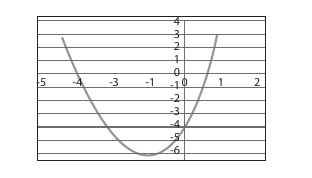

# 第四章 自由函数的实现

**前章回顾**

C++中有许多可供所有程序员重用的自由函数，我们可以通过访问`http://www.cplusplus.com/reference`来获取这些函数的文档。在编程过程中，将相关的代码组合成一个定义明确的函数，以供日后测试并调用，已经被认为是一种非常好的实践经验，这有助于我们构建出可读性更强的程序。但C++本身不可能提供我们每个人在所有应用场景中所需要用到的函数。

**本章提要**

本章将重点介绍如何编写属于自己的函数。我们希望在完成本章的学习之后，你将掌握：

* 如何实现自由函数。
* 如何传递相关的值给你的函数，以作为它的输入。
* 如何从你的函数中返回相对值，以作为它的输出。
* 如何测试你的新函数。
* 初步理解对象与函数的所在域。

## 4.1 实现属于自己的函数

从上一章提到的那些函数（譬如`min`、`max`、`abs`、`round`和`sqrt`）可以看出，函数的定义应该是一个函数头信息加上一个语句块。

**通用格式 4.1**： *自由函数*

> *function-heading* <br>
> *block*

其中，*block*是一个以`{`开头，并以`}`结尾的语法单元，其内容主要由变量声明和执行语句等部分组成。

**通用格式 4.2**: *语句块*

> { <br>
> *object-initializations* <br>
> *statements* <br>
>}

函数的输入就是调用该函数的实参。在获取输入之后，函数会利用这些输入值计算出某个结果，然后将其返回给它的调用者。我们之前已经介绍过如何通过实参与形参关联配对的方式将值输入到函数中，下面我们来介绍如何通过返回语句将值传回给调用该函数的代码。

**通用格式 4.3**： *返回语句*

> return *expression* ;

我们可以具体示范一下将值返回给调用方代码的做法：

```C++
int minOf3(int a, int b, int c) {
    // post: Return the smallest value amongst the 3 arguments
    return min(a, min(b, c));
}
```

当程序执行到返回语句时，`return`后面的表达式将会实际替换掉调用方代码调用该函数的位置，以作为程序控制权返回的地方。接下来，我们来实现一个名为`f`的函数$f(x) = 2x^2−1$。需要提醒的是，这个函数的编码必须写在调用它的函数之前，也就是说，函数`f`必须位于调用它的`main`函数之前。

```C++
#include <iostream>          // For cout
#include <cmath>             // For pow
using namespace std;

double f(double x) { // post: Return 2 * x * x - 1
    double result;
    result = 2 \* pow(x, 2) - 1.0;
    return result;
}

int main() {
    double x, y;
    cout << "Input x: ";
    cin >> x;
    // Call function f:
    y = f(x);
    cout << "f(" << x << ") = " << y << endl;
    return 0;
}
```

**程序会话**

```shell
Input x: ***1.01***
f(1.01) = 1.0402
```

**自检题**

4-1 请根据之前示例中实现的$f(x) = 2x^2−1$，写出下列函数调用的返回值，如果调用出错，请说明出错原因。

* a. `f(0.0)`
* b. `f(-2.0)`
* c. `f(3)`
* d. `f(1, 2)`
* e. `f()`
* f. `f(5.8)`

在接下来的这个示例中，函数`serviceCharge`所声明的返回值类型是`double`，因此调用`serviceCharge`函数的地方将会被替换成某个`double`值，而该值则取决于其调用实参的值。

```C++
// Call serviceCharge to determine a bank debit
#include <iostream>
using namespace std;

const double MONTHLY_FEE = 5.00;

double serviceCharge(int checks, int ATMs) {
    // pre: checks >= 0 and ATM >= 0
    // post: Return a banking fee based on local rules
    double result;

    result = 0.25 * checks + 0.10 * ATMs + MONTHLY_FEE;
    return result;
}

int main() {
    // 0. Initialize objects
    int checks;
    int ATMs;
    double fee; // Stores the function return result

    // 1. Input
    cout << "Checks this month? ";
    cin >> checks;
    cout << "ATMs this month? ";
    cin >> ATMs;

    // 2. Process
    fee = serviceCharge(checks, ATMs); //Call to serviceCharge

    // 3. Output
    cout << "Fee: " << fee << endl;

    return 0;
}
```

**程序会话**

```shell
Checks this month? ***17***
ATMs this month? ***9***
Fee: 10.15
```

如你所见。上述程序在运行过程中发生了以下事情：

1. 用户被要求输入自己使用支票和ATM进行交易的次数。
2. 调用实参的值（即17和9）被传递给了`serviceCharge`函数的形参（即`checks = 17`和`ATMs = 9`），该函数将根据这些被指定的值来返回当前月需支付的银行手续费。
3. `serviceCharge`函数中的语句都会被执行。
4. `serviceCharge`函数最终会遇到`return`关键字。
5. `main`函数中的函数调用`serviceCharge(checks, ATMs)`将会被替换成该函数返回的值10.15。
6. 函数的返回值将会被赋值给`fee`。
7. `fee`会被输出显示。

### 4.1.1 测试驱动程序

当我们需要用实参调用函数时，在两个不同的地方声明相同变量名声明的情况并不罕见。以之前的程序为例，`main`函数中声明的`checks`和`ATMs`同时也是`serviceCharge`函数的形参。`main`函数中声明的对象是用来获取用户输入的，而`serviceCharge`函数声明的形参则用来获取来自`main`函数的输入。尽管它们使用了相同的变量名，但它们是不同的变量。

当然，有时候我们也不需要在形参上复制`main`函数中的同名对象。在下面的程序中，我们将会看到这回没有用户输入操作了，自然也 就没有对象需要复制。取而代之的是，这会我们用来测试函数的实参是一些常量，而且这次也不再需要将返回值赋值给另一个对象了，程序会直接显示返回结果。这段程序唯一的功能就是测试函数——验证其返回值是否符合预期。在将该函数应用到更大的程序中之前，做一些这样的测试是一件好事。事实上，许多编程问题都需要我们进行这种形式的测试。

```C++
// The main function makes several calls to test a new function

#include <iostream>
using namespace std;

const double MONTHLY_FEE = 5.00;

double serviceCharge(int checks, int ATMs) {
    // pre: checks >= 0 and ATM >= 0
    // post: Return a banking fee based on local rules
    double result;
    result = 0.25 * checks + 0.10 * ATMs + MONTHLY_FEE;
    return result;
}

int main() {
    // Test drive serviceCharge          // Sample problems:
    cout << serviceCharge(0, 0) << endl; // 5.0
    cout << serviceCharge(1, 0) << endl; // 5.25
    cout << serviceCharge(0, 1) << endl; // 5.1
    cout << serviceCharge(1, 1) << endl; // 5.35
    return 0;
}
```

**程序输出**

```shell
5
5.25
5.1
5.35
```

这个版本的`main`函数叫做*测试驱动程序（test driver）*，这是一种专门用于测试新函数的程序。譬如，像`serviceCharge`、`sqrt`和`pow`这些函数通常都只是较大型程序中的一小部分，因此在它们被重用之前全都应该经过全面性的测试。另外，对于上面所呈现的四个样本问题。我们都在对应的注释中注明了自己的预期值。如你所见，对于`serviceCharge`函数来说这是一个成功的测试程序。

### 4.1.2 只有一条返回语句的函数

有时候我们会看到一些极其简单的函数，它们可能只有一条返回语句。譬如：

```C++
double serviceCharge(int checks, int ATMs) {
    // pre: checks >= 0 and ATM >= 0
    // post: Return a banking fee based on local rules
    return 0.25 * checks + 0.10 * ATMs + MONTHLY_FEE;
}
```

但除了上面这种极其简单（即只包含一条返回语句）的函数外，本书在定义函数时都将遵守以下约定：

1. 我们会声明一个名为`result`的局部变量，并且它的类型与函数定义的返回类型相同。
2. 然后将最终所需的值存储到变量`result`中。
3. 最后返回`result`。

虽然，这种约定在简单函数中会显得有些多余。但在第7章“选择操作”之后，这种模式将会非常有助于我们面对那些日益复杂的处理操作。

除此之外，看似多余的这两行代码有时还能避免一个非常常见的错误。这或许是因为其他编程语言在技术上支持这样做，或许是因为想当然，总之我们常常会试图将一个值赋值给函数名，这会导致编译时错误，因为只有变量才能被赋值。

```C++
double serviceCharge(int checks, int ATMs) {
    // You cannot assign a value to a function name
    serviceCharge = 0.25 * checks + 0.10 * ATMs + 5.00; // ERROR
    return serviceCharge; // ERROR, attempt to return function
}
```

当然，如果你真的犯了这个常见的错误，编译器会告知你的。我们只需要在表达式中加上正确的返回值类型`double`就可以修复这个错误，然后就可以返回这个函数了。

**自检题**

4-2 请根据下面给出的函数`f1`，写出`f1(9.0)`这个调用的返回值。

```C++
double f1(double x) {
    // pre: x is zero or positive, but not 1.0
    // post: Return f(x) = (square root of x) / ( x - 1.0 )
    return sqrt(x)/(x - 1.0);
}
```

4-3 `f1(-1.5)`这个函数调用是否满足上述函数的前置条件？使用负数做实参调用`f1`函数会发生什么情况？

4-4 请分别说明下列函数中错误的修复方法。

* a
    ```C++
    double f1(int j);{
        return 2.5 * j;
    }
    ```
* b
    ```C++
    double f2(int) {
        return 2.5 * j;
    }
    ```
* c
    ```C++
    double f3(int x) {
        return 2.5 * j;
    }
    ```
* d
    ```C++
    double f4(double x) {
        return 2.5 * x;
    }
    ```
* e
    ```C++
    double f5(double x) {
        return double;        ;
    }
    ```
* f
    ```C++
    int f6(string s) {
        return s;
    }
    ```

4-5 请编写一个名为`times3`的函数，该函数的功能是返回一个三倍于其实参的值（譬如`times3(2.0)`应该返回6.0）。

## 4.2 分析、设计与实现

与编写程序相比，实现函数所需要考虑的问题只是一个大型程序中的一小部分。它可能只是某个算法中的一个步骤，只不过经常会被调用罢了。

*问题：* 计算出两点之间的距离。

### 4.2.1 分析

还记得吗？我们在程序开发的分析阶段会涉及到如何确定输入与输出，另外还有用计算机解决问题时常涉及的IPO算法模式。也就是说，开发者必须得先确定哪些是必须要发送给用户的输出，哪些是用户所需要提供的输入。在函数的设计中，我们只需要将之前的*用户*替换成*客户端*，IPO模式一样是可以适用的。除此之外，函数的输出现在变成了函数的返回语句，而输入则变成了函数实参与形参的关联配对。下面，我们来描述一个适用于函数而不是程序的通用IPO算法模式。

**适用于函数的IPO模式**

* 输入：经由实参与形参之间的关联配对动作将相关值输入给函数。
* 处理：计算出待返回的结果。
* 输出：返回结果。

问题样例是我们确定自己是否已经理解目标问题是一个好方法。而且在程序测试过程中，这些样例所提供的预期结果也可以被拿来与程序的输出进行比对。同样地，为新函数开发一组问题样例也是一个很好的主意，我们可以通过这些样例来确定函数所需的输入。也就是要在函数头信息中写明的形参类型及其数量。当然，问题样例也为我们的测试驱动程序提供了预期的输出值。

根据以下公式可以看出，想要计算出（$x_1$, $y_1$）与（$x_2$, $y_2$）这两点之间的距离，我们需要四个`double`类型的值：

$$distance = \sqrt{{(x_1 - x_2})^2 + {(y_1 - y_2)}^2}$$

下面是几组$x_1$、$y_1$、$x_2$、$y_2$的值以及预估的输出。

**问题样例**

| $x_1$ | $y_1$ | $x_2$ | $y_2$ | Distance |
|-------|-------|-------|-------|----------|
| 1.0   | 1.0   | 2.0   | 2.0   | 1.414    |
| 0.0   | 0.0   | 3.0   | 4.0   | 5        |
| -5.7  | 2.5   | 3.3   | –4.7  | 11.5256  |
| 0.0   | 0.0   | 0.0   | 0.0   | 0.0      |

接下来，我们要将IPO模式应用到该函数中去：

* 输入：我们会以（$x_1$，$y_1$）和（$x_2$，$y_2$）这两点为参数来调用函数。
* 处理：按照$\sqrt{{(x_1 - x_2})^2 + {(y_1 - y_2)}^2}$这个运算公式来进行求值。
* 输出：返回计算结果。

### 4.2.2 设计

作为设计者，我们必须要确定函数需要多少参数以及这些参数的类型。在当前这个示例中，我们需要四个值来表示两个点（分别命名为`x1`、`y1`、`x2`、`y2`）。这些形参最合适的类型应该是`double`（即5.62、-9.864这样的值）。另外，函数返回值最合适的类型也是`double`，因为我们的计算将涉及到平方根函数，`double`类型有助于返回较为精确的答案。最后，该函数将被命名为`distance`，这个函数名很清晰地说明了这个函数的功能。总结一下，这个函数的头信息应该是：返回值类型为`double`、函数名为`distance`、四个具有描述性名称的`double`类型的形参。具体如下：

```C++
double distance(double x1, double y1, double x2, double y2)
// post: Return distance between two points (x1, y1) and (x2, y2)
```

接下来，在函数体内（即之前提到的语句块），我们要将`x1`、`y1`、`x2`、`y2`这四个形参代入距离计算公式，计算出结果：

```C++
result = sqrt(pow((x1 - x2), 2) + pow((y1 - y2), 2));
```

### 4.2.3 实现

在下面的程序中，除了上述所有内容的实现，我们还专门为其编写了一个用作测试函数的`main`函数（即测试驱动程序）：

```C++
// Call distance four times
#include <iostream>    // For cout
#include <cmath>       // For sqrt and pow
using namespace std;

double distance(double x1, double y1, double x2, double y2) {
    // post: Return the distance between any two points
    double result;
    result = sqrt(pow((x1 - x2), 2) + pow((y1 - y2), 2));

    return result;
}

int main() {
    // Test drive the distance function
    cout << "(1.0, 1.0) (2.0, 2.0): "
         << distance(1.0, 1.0, 2.0, 2.0) << endl;
    cout << "(0.0, 0.0) (3.0, 4.0): "
         << distance(0.0, 0.0, 3.0, 4.0) << endl;
    cout << "(-5.7,2.5) (3.3,-4.7): "
         << distance(-5.7,2.5, 3.3,-4.7) << endl;
    cout << "(0.0, 0.0) (0.0, 0.0): "
         << distance(0.0, 0.0, 0.0, 0.0) << endl; 
    return 0;
}
```

**程序输出**

```shell
(1.0, 1.0) (2.0, 2.0): 1.41421
(0.0, 0.0) (3.0, 4.0): 5
(-5.7,2.5) (3.3,-4.7): 11.5256
(0.0, 0.0) (0.0, 0.0): 0
```

实参与形参之间的关联配对操作与程序的输入操作非常类似。以上述代码中对`distance`函数的第二次调用为例，作为输入，以下四个值会这样被复制给`distance`函数：

```C++
double distance(x1,  y1,  x2,  y2)
                 ↑    ↑    ↑    ↑  
       distance(0.0, 0.0, 3.0, 4.0)
```

接下来，控制权就被移交给了函数，它将会利用其形参计算出实参所表示的那两点之间的距离，以下是它的计算步骤：

```C++
sqrt(pow((x1  -  x2), 2) + pow((y1  -  y2), 2))
sqrt(pow((0.0 - 3.0), 2) + pow((0.0 - 4.0), 2))
sqrt(pow((  -3.0   ), 2) + pow((  -4.0   ), 2))
sqrt(           9.0      +         16.0       )
sqrt(                  25.0                   )
                        5.0                   )
```

这四个实参可以成为函数的输入，是因为系统会负责将四个实参的值复制给其各自所关联的形参。这种实参与形参之间的关联操作模式我们称之为*值传递（pass by value）*，因为传递到函数中的都是变量的值。当一个函数需要以`double`、`int`这样的小型对象输入时，函数头信息中的形参必须要写成以下这种形式：

> *class-name identier*

### 4.2.4 测试

对函数进行分别测试是一个不错的想法。我们在上述程序中就是这样做的。该程序没有做别的，就是使用了几组不同的实参调用了目标函数，并输出显示了它的返回结果。请注意一下这四个调用与问题样例之间的比对。实参是函数的输入，返回结果应该与其预期结果相匹配。

建议你们也要用一个测试驱动程序来测试自己的新函数。

### 4.2.5 标识符的域

标识符的*域（scope）*指的是程序中可以引用到该标识符的那个部分。通常情况下，一个标识符的域会从它被声明之处开始，一直延续到该声明所在的语句块结束为止。还记得吗？语句块是以一对左右大括号`{ }`区隔开的语法单元。例如在下面的程序中，`local`的域应该就是`one`函数。这个`local`变量是在`one`函数中被声明的，其语句块以外的地方是无法引用该标识符的，包括`main`函数。

```C++
// Illustrate the scope of an object
#include <iostream>
using namespace std;

const int maxValue = 9999;

void one() {
    int local = -1;
    // The scope of local is this function
    cout << local << endl;
    // maxValue is known after its declaration including here:
    cout << maxValue << endl;
}

int main() {
    // The scope of local is limited to one() so this is an error:
    local = 5;
    // Function one() is known everywhere after its declaration
    one();
    // maxValue is known everywhere after its declaration
    cout << maxValue << endl;
    return 0;
}
```

当变量被声明在语句块之外时（譬如上面的`maxValue`），该变量的域就会从其被声明之处开始，一直延续到该文件的末尾。声明在语句块内的标识符只能在该语句块内被引用，这些标识符被称之为*局部*标识符。而声明在语句块之外的标识符（像`maxValue`这样的）则被称之为*全局*标识符，全局标识符可以被其在文件中被声明的位置之后的任意部分引用，除非另有语句块也声明了这个标识符（也就是该标识符被重新声明了）。在后一种情况中，先声明的标识符黑被后来的重新声明隐藏。由于同一个程序中会存在多个语句块，所以确定一个对象的域有时候会是件复杂的事。例如在下面的程序中，我们声明了三个不同的int变量`identier`，你可以试着猜测一下它会输出什么:

```C++
// This program is a tedious test of your ability to
// determine which of the three int variables named
// identier are being referenced at any given point.
#include <iostream>
using namespace std;

const int identier = 1; // Global variable

void one() {
    // This is a reference to the global identier
    cout << "identier in one(): " << identier << endl;
}

void two() {
    int identier = 2; // local to two()
    cout << "identier in two(): " << identier << endl;
}

int main() {
    int identier = 3; // local to main()
    one();
    two();
    cout << "identier in main(): " << identier << endl;
    return 0;
}
```

**程序输出**

```shell
identier in one(): 1
identier in two(): 2
identier in main(): 3
```

如你所见，当函数`one`被调用时，它引用的是全局声明`global const int identier = 1`。这个全局的`identier`可以在所有没有另行声明`identier`这个标识符名的函数中被引用。因此，`one`函数尽管自身内部并没有声明`identier`。但它可以引用第一个被声明的，初始值为1的`identier`。 但在函数`two`引用`identier`这个标识符时，由于全局的`identier`就被局部的`identier`隐藏掉了，当程序出现执行到此处时，函数`one`的输出是1，函数`two`的输出是2。同样地，`main`函数最后一条语句所引用的`identier`也应该是`main`声明的局部`identier`，其初始值为3。

通常情况下，函数都会在其语句块开头声明一个或多个变量。这些变量都属于局部变量，因为它们只能在该函数内部被引用。同样的限制也被引用到了函数的形参上。函数的形参是一种声明在`( )`之间的局部变量，它并不位于函数的语句块内。这种限制为局部变量提供了一种安全保护，能确保其不会意外地被程序的其它部分修改。

```C++
void f1(double x) {
    int local = 0;
    str = "A"; // Error attempting to reference main's local str
}

int main() {
    string str; // str is local to main
    x = 5.0; // Error attempting to reference f1's parameter x
    local = 1;
    // Error attempting to reference f1's local return 0;
}
```

**自检题**

4-6 请根据下面给出的部分程序，判断这些函数是否可引用以下标识符。其中，`cin`和`cout`的初始化在`iostream`文件中已经完成，因此在`#include <iostream>`之后，也都属于已知标识符了。

```C++
// cout b cin MAX c f1 a d f2 main e
#include <iostream>
using namespace std;

const int MAX = 999;

void f1(int a) {
    int b;
}

void f2(double c) {
    double d;
}

int main() {
    int e;
    return 0;
}
```

4-7 请命名一下函数中可以被声明为局部变量的两种东西。

4-8 如果一个变量被声明在了一个函数之外，在哪些地方可以引用它？

### 4.2.6 函数名的域

那么，函数名的情况又如何呢？它们毕竟也是标识符啊，它们的域是什么呢？和`cin`和`cout`对象一样，在被包含文件（譬如`cmath`文件）中的这些函数名的域是从该文件开始，一直到执行了`#include <cmath>`指令的文件末尾。因此`sqrt`、`pow`、`ceil`和`fabs`这些函数，都可以在所有的语句块中被调用，除非这些函数名被重新声明成了其他东西。

### 4.2.7 全局标识符

到目前为止，我们遇到的问题都不算复杂，它们的规模都不算大，相信大家在自己的工作中实际上或多或少都已经接触过了。但是，当问题的规模达到一个团队的级别时，我们对于域的使用就必须要谨慎了。

由于全局标识符在被声明之后，对于程序中所有的地方都是可见的，这意味着它们是完全开放的，我们可以在一个大型程序中的任何一个地方修改它们。这样一来，就很难保障团队中没有人会在错误的时间意外地修改了某个对象。所以我们认为，尽量使用局部变量是大家需要养成的一个好习惯。也就是说，我们应该尽量使用`( )`之间定义的形参和`{ }`之间定义的对象来做事。例如下面`main`函数中的`localX`和`localY`就属于局部变量：

```C++
int main() {
    double localX, localY;
    // . . .
}
```

如果我们需要在函数之间搬运数据，就需要使用实参来传递，这样的话我们就必须要在函数中声明相应的形参，这比使用全局变量`x`来得好：

```C++
double f(double x) { // x is local to f
    double result; // result is local to f
    // Do something with x . . .
}
```

如果我们确实需要一个贯穿整个程序，在许多地方都会用到的值，建议将其声明成`const`对象：

```C++
#include <iostream>
using namespace std;

const int MAXIMUM_ENTRIES = 100; // ... a large program with many functions may follow
```

然而从另一方面来说，我们在C++中也确实经常会用到全局标识符。譬如在引入<iostream>这个头文件之后，`cout`就是一个对于任何地方都可见的对象。当然，前提是我们做了`using namespace std;`这条声明，免去了在引用`cout`时要为其加上`std::`前缀的麻烦，否则，我们每次都要在`cout`的前面（也就是它的左边）加上`std::`这个限定词。

```C++
#include <iostream>
using namespace std;

void f() {
    cout << "In f\\n";
}

void g() {
    cout << "In g\\n";
}

int main() {
    f();
    g();
    cout << "In main\\n";
    return 0;
}
```

```C++
#include <iostream>
// Equivalent code with std::
void f() {
    std::cout << "In f\\n";
}

void g() {
    std::cout << "In g\\n";
}

int main() {
    f();
    g();
    std::cout << "In main\\n";
    return 0;
}
```

实质上，就是`using namespace std;`这个声明将`cout`变成了一个全局标识符。这样做是好的吗？好吧，确实有大量的计算机科学家是这样认为的。因为控制台环境通常都是唯一的，`cout`的任何输出都只能被传递给同一个控制台环境，这种情况下我们无需关心具体是哪个函数发出的输出。

## 4.3 void函数与引用型形参

当我们将函数的返回值类型声明成关键字`void`时，就表示该函数不返回任何东西。与返回某些值给客户端的函数不同的是，`void`函数通常会改变传递给它的对象的状态。在本节，我们可以来演示一下如何实现一个叫做`swap`的`void`函数，它对自己的两个实参做了修改。首先，一个函数要想在其调用过程中修改其实参对象的状态，它就必须要使用引用型形参（reference parameter）——即在声明时加上`&`。其通用格式如下：

**通用格式 4.4**：*引用型形参*

> *class-name* & *identier*

**示范在函数头信息中声明引用型形参**

```C++
void swap(double & parameterOne, double & parameterTwo)
void changeFormat(ostream & cout)
```

（使用＆声明的）引用型形参上的变化会修改其所关联的实参，其参数名代表的是一个内存位置，实际上是对该形参所关联实参的引用。

虽然函数的形参通常得从它的调用者获取输入，但形参与实参之间有时候会建立起更强的联系。在下面第一个关于引用型形参的用法示范中，由于`swap`函数必须修改两个对象，而通过`return`语句只能返回一个值，因此该函数需要返回给调用方的值是比`return`语句要多的。当我们在函数头信息中给各形参名前面加上`＆`这个特殊符号时，该函数节后的就是实参内存位置的引用，而不是实参的复制品了。

当引用型形参上发生变更操作时，它将会引起被引用实参对象的同样变更。这是因为该函数的形参和实参指向的是内存中的同一对象。例如在下面的程序中，当`swap`函数修改`parmOne`和`parmTwo`这两个形参时，实参argOne和argTwo也指向了同一个修改过的对象：

```C++
// Notice the reference symbol & is in front of parmOne
// and parmTwo. Now a change to parmOne or parmTwo alters
// the associated object that is the argument's value.

#include <iostream>
using namespace std;

// Swap the values of any two int arguments.
// The & lets any change to the parameter alter it argument
void swap(int & parmOne, int & parmTwo) {
    int temp = parmOne;
    parmOne = parmTwo; // Change argument argOne in main
    parmTwo = temp;    // Change argument argTwo in main
}

int main() {
    int argOne = 89; // argOne argTwo
    int argTwo = 76;

    cout << argOne << " " << argTwo << endl; // 89 76
    swap(argOne, argTwo);
    cout << argOne << " " << argTwo << endl; // 76 89

    return 0;
}
```

**程序输出**

```shell
  89             76
  76             89
```

如果我们将上述程序中的＆符号拿掉，`main`中的实参就不会发生任何变化。因为在这种情况下，`argOne`和`argTwo`执行的是按值传递，而不是引用传递。也就是说，在没有参考符号＆的情况下，`parmOne`和`parmTwo`中值的变化是局部性的。只在`swap`函数中有效，而其在`main`中所关联的实参则不受影响，因为它们是不同的对象。

下面，我们用一张表来说明一下引用兴趣形参与值类型形参之间的差异。

**引用型形参**：*实参与形参引用的是同一个对象*

```C++
parmOne = address of argOne and parmTwo = address of argTwo

void swap(int & parmOne, int & parmTwo) {
    parmOne
    parmTwo 89-  76  由于parmOne与argOne指向的是相同的内存位置，所以
            76-  89  在swap函数中将89改成76也会同步影响到argOne所指的对象。

}

int main() {
    argOne
    argTwo           由于parmTwo与argTwo指向的是相同的内存位置，所以
                     在swap函数中将76改成89也会同步影响到argOne所指的对象。

}
```

**值类型形参**：*形参上的变化不会改变其关联实参的值*

```C++
parmOne = 89 (value of argOne) and parmTwo = 76(value of argTwo)

void swap(int parmOne, int parmTwo) {
    parmOne   89- 76    由于parmTwo中的值是以按值传递的方式传入swap函数的，
              76- 89    所以swap中的局部操作不会影响到其他不同的函数。
}

int main() {
    argOne    89
    argTwo    76
                        由于是这里的参数是“按值传递”的，
                        所以main中的值不受任何影响。
}
```

由于引用型形参上的变化会同步引起实参的变化，所以实参必须是一个变量，如果在这里使用字面常量表达式来调用函数，会导致编译时错误。

```C++
swap(89, 76); // Error: Argument must be a variable
```

**自检题**

4-9 请写出下面各段代码在执行到`return 0;`时`arg1`和`arg2`的值。

* a.
    ```C++
    #include <iostream>
    using namespace std;
    void changeOr(int a, int b) {
        a = a * 2 + 1;
        b.  = 123;
    }

    int main() {
        int arg1 = 5;
        int arg2 = 5; changeOr(arg1, arg2); // arg1 ____ arg2 _____
        return 0;
    }
    ```

* b.
    ```C++
    #include <iostream>
    using namespace std;
    void changeOr(int & a, int & b) {
        a = a * 2 + 1;
        b = 123;
    }

    int main() {
        int arg1 = 5;
        int arg2 = 5;
        changeOr(arg1, arg2); // arg1 ____ arg2 ____
        return 0;
    }
    ```

## 4.4 const的引用型形参

到目前为止，在C++的以下三种形参传递模式中，我们已经介绍了其中的两种：

1. 值传递形参 —— 这类形参主要用于传递`int`这类小型对象的值。
2. 引用型形参 —— 这类形参允许在被调用函数中同步修改一个或多个实参的状态。
3. `const＆`（引用）型形参 —— 这类形参主要考虑的是参数传递的安全和效率。

`const`的引用型形参通常主要用来传递一些不允许被调用函数修改的“大型”对象。大型对象通常指的是会占用大量内存的对象，譬如非常大的字符串等。至于为什么程序员要通过const的引用来传递大型对象，我们首先要理解当实参被传递给函数时，具体会发生哪些事。

如果执行的是按值传递，整个目标对象都会被复制到函数中另一个相同大小的变量中，这块数据所需要的内存就等于翻了一倍。而如果是引用型形参的话，我们就只需将目标对象的地址复制给函数即可。在这种情况下，该函数就只需要四个字节的内存。因为这是实参和形参引用的是相同的对象。而如果是`const &`形参的话，目标对象的地址一样会被复制给函数，该函数同样只需要增加四个字节的内存，但由于形参被声明成了`const`，函数中任何尝试修改形参值的动作都会被编译器标记为错误。也就是说，我们可以用`const`来防止被调用函数对其实参的意外更改。程序员们可以通过添加`const`限定词来避免相关对象因不同域中不可预知的修改而产生的bug。

| 按值传递`int f1(int j)` | 引用传递`int f2(string & b)` | `const`引用传递`void f3(const int & n)` |
|------------------------|-----------------------------|---------------------------------------|
| 这种方式需要获得足够的内存来存储整个目标对象，后者所有的字节都会被复制到函数中，而该函数对形参做的任何修改都不会影响到其实参。| 这种方式会用四个字节的内存来存储目标对象的地址，后者的地址将会被复制给函数，当我们需要对函数的实参进行同步修改时可以使用这种方式，这也是非常有效率的方式。| `const`表示的是函数实参的内容是包括修改的，任何企图修改`n`的操作都会导致编译时错误，这是一种安全且高效的传递方式。|
| `f1`无法修改实参的状态。| `f2`可以修改实参的状态。| `f3`无法修改实参的状态，但这种传递方式的销效率很好。|

我们选择使用`const`的引用型形参主要有两个原因。首先是执行效率——即这种方式可以让程序执行得更快。另一个因素是更好的内存利用率——即这种方式可以让函数以更小的内存存储大型对象。例如，按值传递`int`这类小心对象，需要在函数中分配四个字节的内存，然后将其整个复制过去。但如果大型对象也按值传递的话，可能就需要数千个字节了，该程序有可能会耗尽计算机上的可用内存。

除此之外，在按值传递的情况下，为了确保实参的每一个字节都能被复制到函数中。计算机必须要为此做大量不必要的工作。这可能会导致程序的运行速度明显变慢。而以下两种传递方式都可以让程序更有效率地使用空间（节省内存）和时间（运行速度更快）：

1. 采用引用传递的方式传递大型对象——这种方式效率很好，但也有一定的风险。
2. 采用传递`const`引用的方式传递大型对象——这种方式既高效又安全。

我们会推荐尽量使用第二种传递方式。这种方式可以让程序减少很多操作。在采用按值传递时，程序必须等到每个字节都从调用者复制到函数中之后才能继续。而如果我们采用`const &`引用的传递方式的话，就只需要传递四个字节，而且在安全性上它与值传递形参的情况是一样的（即不会改变实参的状态）。当然，如果我们需要在函数中修改实参的状态的话，那就得选择带`&`符号的引用传递了。

任何企图修改`const`引用所传递对象的操作都会导致编译时错误。`const`的使用一种纠错技术，它可以让编译器告知我们程序中所有针对`const`形参的意外修改。在这种情况下，大多数不修改对象的函数仍会继续完成调用动作——譬如`string`对象的`length`函数，我们会在下一章中讨论它们。但是，编译器也会标记出`string`对象的`insert`这一类函数的调用。而顾名思义，`insert`函数显然是要在`string`对象中添加内容的，它必然要改变该对象的状态，这时候就不能将新值赋值给一个`const`的引用型形参了。

```C++
void addSomeStuff(const string & str) {
    cout << str.length() << endl;   // Okay
    str.insert(5, "xtra");          // ERROR: can not modify a const parameter
    str = "new string";             // ERROR: Can not assign to a const parameter
}
```

但是，如果我们这里采用的是值传递的形参，就不会收到这样的报错消息了，因为其实参对象根本不会被改变。

| 在`f`函数中修改`x`，并不会改变`main`函数中`y`的值。| 这段代码会产生”无法修改const对象“这样的编译时错误。|
|--------------------------------| ------------------------------------|
| | |

```C++
#include <iostream>
using namespace std;
double f(double x) {
    double result;
    // This does not modify y
    x = x – 1.5;
    result = 2 * x;
    return result;
}
int main() {         // Output:
                        // 8
    double y = 5.0;  // y: 5
    cout << f(y) << endl;
    cout << "y: " << y << endl;
    return 0;
}
```

```C++
#include <iostream>
using namespace std;
double f(const double & x) {
    double result;
    // An error. Good!
    x = x – 1.5;
    result = 2 * x;
    return result;
}

int main() {
    double y = 5.0;
    cout << f(y) << endl;
    cout << "y: " << y << endl;
    return 0;
}                                                                                                    ```
```

当然，我们以后应该会注意到通常只有少量的对象可以采用`const`引用的传递方式，在接下来的章节中，读者们只会偶尔看到使用`const` 引用的方式来传递大型对象。而且，值传递形参也会比引用型形参更常见。

## 本章小结

* 函数所执行的往往是一些已经被定义好的服务，它主要借由实参与形参的关联以及`return`语句来实现双向通信。也就是说，其客户代码会以实参的形式将要输入的值传递给函数，后者则会通过`return`语句来返回结果。
* 本章还涉及了几个在函数实现中会遇到的新问题，譬如在标识符的域方面：
  * 所有的标识符都必须要先声明再引用。
  * 对象的域通常都只局限于声明它的语句块内。
  * 对于那些未在任何语句块中声明的标识符，我们通常称之为全局标识符。譬如我们在`#include <cmath>`之后使用的函数`sqrt`，以及在`#include <iostream>`之后使用的对象`std::cout`，都属于全局标识符。
  * 函数形参的域只局限于其所在的函数内。
  * 函数的域应该是从函数头信息的声明之处开始，一直持续到其声明所在文件的末尾，或`#include`了该文件的文件末尾。
* 在进行实参与形参之间的关联配对时，我们需要记住很多细节：
  * 在调用函数时所用的实参数量必须要与被调用函数的头信息中声明的形参数量相匹配。
  * 在函数名之前冠以`void`返回值类型，代表该没有返回值。`void`函数是不能返回任何对东西的。
  * 当我们需要让函数要返回某个值时，就必须要在函数头信息的开头将其定义成非`void`的返回值类型，其函数语句块中也必须包含相应的`return`语句，并且`return`语句中的表达式类型也必须与返回值类型相同。
  * 在调用函数时，我们有时会需要它能接收输入——这就是形参的用途。有时会需要函数能返回某些东西——这就是`return`语句的用途。有时会需要在函数中直接修改客户端代码中的对象——这就是引用型形参的用途。
  * 在调用函数时所用的实参通常应该与其所关联的形参属于同一类型，当然，情况也有例外，譬如`int`类型的实参是可以通过类型转换机制直接赋值给`double`类型的形参的。
  * 只用于接受实参值副本的形参（输入型形参）在声明时是不带`＆`的值传递形参。
  * 如果我们需要利用形参来修改其所关联的实参，就必须使用引用型形参（即使用`＆`符号来声明）——也就是说，引用型形参上发生的变化会同步给其关联实参，值传递形参则没有这样的功能。
  * `const`的引用型形参主要用于传递大型对象，这可以避免掉一些大量耗费内存字节的复制操作——这一点声明成`＆`就可以做到了，而加上`const`则是为了增加形参的安全性。

## 练习题

1. 在`{ }`所括起来的语句块之间可以写多少条语句？

2. 在C++程序执行时，它首先要调用的是哪一个函数？

3. 同一个函数可以被调用一次以上吗？

4. 请写出下面程序会输出的内容：
    ```C++
    #include <iostream>
    using namespace std;
    double f2(double x, double y) {
        return 2 * x - y;
    }

    int main() {
        cout << f2(1, 2.5) << endl;
        cout << f2(-4.5, -3) << endl;
        cout << f2(5, -2) << endl;
        return 0;
    }
    ```
5. 请写出下面函数会输出的内容：
    ```C++
    #include <iostream>
    #include <cmath>
    using namespace std;

    double mystery(double p) {
        return pow(p, 3) - 1;
    }

    int main() {
        double a = 3.0;
        cout << mystery( a) << endl;
        cout << mystery(4.0) << endl;
        cout << mystery( -2) << endl;
        return 0;
    }
    ```
6. 请编写一个返回值类型为`double`的`sumOf3`函数，它的功能是返回三个`double`值的和值，譬如`sumOf3(1.5, 2.2, 3.7)`返回的结果应该是7.4。

7. 请编写一个返回值类型为`int`的`maxOf4`，它的功能是返回四个整型实参中的最大值，譬如`maxOf4(99, 2, 99, -4)`返回的结果应该是99。

8. 在下面的代码中，其所引用的这些标识符的域各是什么？
    * a. std
    * b. cin
    * c. MAX
    * d. aaa
    * e. string
    * f. f
    * g. result
    * h. s
    * i. cout

    ```C++
    #include <iostream>
    #include <cmath>
    using namespace std;

    const double MAX = 2.0;

    double f(double aaa) {
        double result;
        result = pow(3.0, aaa);
        return result;
    }

    int main() {
        string s = "a string";
        cout << f(MAX);
        return 0;
    }
    ```

9. 值传递形参上发生的变化会导致其关联的实参被修改吗？

10. 引用型形参上发生的变化会导致其关联的实参被修改吗？

11. 请写出下面程序会输出的内容：
    ```C++
    #include <iostream>
    using namespace std;

    void changeArgs(double & x, double & y) {
        x = x - 1.1;
        y = y + 2.2;
    }

    int main() {
        double a = 3.3;
        double b = 4.4;

        cout << a << " " << b << endl;
        changeArgs(a, b);
        cout << a << " " << b << endl;
        changeArgs(a, b);
        cout << a << " " << b << endl;
        return 0;
    }
    ```

## 编程小技巧

1. 我们在写函数时经常会犯以下这些错误：
   * 在函数的头信息后面放一个分号：
    ```C++
    string move(int n) ; // ERROR
    { // many errors agged here. Remove ; from line above
    }
    ```
    * 给函数名赋值：
    ```C++
    double f(double x) {
        f = 2 * x; // ERROR: Can not assign value to function
        return f;  // ERROR: Can not return a function name
    }
    ```
    这个问题的解决方法是：为其声明一个局部对象，将相关的值赋值给这对象，然后返回它。在函数较为简单的情况下，也可以选择直接返回表达式：
    ```C++
    double f(double x) {
        return 2 * x;
    }
    // or do this when there is more going on inside the function:
    double f(double x) {
        double result;
        result = 2 * x;
        return result;
    }
    ```
    * 在非`void`函数中忘了返回值操作：
    ```C++
    double f2(double x) {
        double result;
        result = 2 * x;
        // ERROR: f2 must return a number
    }
    ```
    * 在`void`函数中执行了返回值操作：
    ```C++
    void foo(double x) {
        return 2 * x; // ERROR
    }
    ```
2. 函数之间相互通信的方式有以下几种：
    * 调用方以按值传递的方式将值和对象发送给函数。
    * 当函数的设计需要修改实参时，调用方会以引用传递的方式将实参对象发送给函数。
    * 当函数的设计不需要修改实参时，为了节省时间和内存，调用方会`const`引用的形式将对象传递给函数
    * 调用方会经由函数的`return`语句获取到函数所返回的值。
    * 调用方会经由函数中对引用型形参的修改从其关联的实参中获得被修改的值。
3. 当我们希望函数返回两个以上的值时，就应该考虑使用引用型形参。因为`return`语句只能返回单一对象，如果我们希望函数返回一个以上的对象，也可以考虑在`return`语句之外，再使用一个以上的引用型形参。

## 编程项目

### 4A SUM THREE

Write the function sumThree that returns the sum of three double arguments.

```C++
// Test drive sumThree
int main() {
    cout << sumThree(1.1, 2.2, 3.3) << endl; // 6.6 cout
         << sumThree(-1, -2, 3) << endl;     // 0
    return 0;
}
```

### 4B ROUNDING TO `n` DECIMAL PLACES

Write a function named round that returns the value of its double argument rounded to the number of decimal places specifi ed as the second argument.

```C++
// Test drive round
int main() {
    // Arguments: number to round (-2.9), decimal places (0)
    cout << round(-2.9, 0) << endl; // -3
    cout << round(-2.59, 1) << endl; // -2.6
    cout << round(0.0059, 2) << endl; // 0.01
    cout << round(1.23467, 3) << endl; // 1.235
    cout << round(9.999999, 4) << endl; // 10
    return 0;
}
```

### 4C PAYMENT

The payment on a loan is a function of the interest rate, the number of payments (periods), and the amount borrowed. Pass these three values as arguments to a function payment that returns the loan payment. The function heading is provided for you along with a test driver. Round your answer to two decimal places (see Section 3.2). See if your answers match an online mortgage calculator.

```C++
#include <iostream> // For the cout object
#include <cmath> // For pow, which you de nitely need here
using namespace std;

double payment(double amtBorrowed, double interestRate, int numPeriods) {
    // TODO: Complete this function
}

int main() { // Test drive payment

    // 6.0 needs to be divided by 100 and then by 12 to become a monthly
    // interest rate, The number of years (30) also needs to multiplied

    // by 12. The following test cases represent a monthly payment.
    cout << payment(185000.00, 6.0/100.0/12, 30\*12) << endl;
    cout << payment(185000.00, 5.0/100.0/12, 30\*12) << endl;
    cout << payment(185000.00, 4.0/100.0/12, 30\*12) << endl;

    return 0;
}
```

Here is the formula used to calculate payments on a loan given the amount borrowed, interest rate for one period, and the number of periods:

$$ Payment = Amount * Rate * \frac{{(Rate + 1)}^{Months}}{{(Rate + 1)}^{Months}-1} $$

### 4D POPULATION GROWTH PREDICTION

According to **http://www.census.gov/popclock/**, at the time of this writing the population growth in the United States can be predicted as follows:

One birth every *8 seconds*

One death every *13 seconds*

One international migrant (net) every *40 seconds*

Write a function that predicts the population for any number of days into the future when also given the current population. Th e following test driver must compile and generate the output shown in comments:

```C++
int main() {
    cout << populationPrediction (320000000, 0) << endl; // 320000000

    // One and two day growth:
    cout << populationPrediction(320000000, 1) << endl; // 320006314
    cout << populationPrediction(320000000, 2) << endl; // 320012628

    // One and two year growth
    cout << populationPrediction(320000000, 365) << endl; // 322304554
    cout << populationPrediction(320000000, 2\*365) << endl; // 324609108

    return 0;
}
```

Once the function has been tested, write a complete program that prompts the user for the current population and the days into the future using a dialog that looks just like this:

```shell
Predict population growth given the current population and days into the future

Current population? 320000000
Day into the future? ***365***
```

In 365 days, the population should grow by 2304554 to become 322304554

### 4E QUADRATIC FORMULA

The quadratic formula (below) uses the `a`, `b`, and `c` from quadratic equations of the form $ax^2 + bx + c$ to find both roots.

$$ x = \frac{-b + \sqrt{b^2 - 4ac}}{2a} $$

For example, the two real roots of *x*^2^ + 3*x* − 4 are 1 and −4 as indicated by this dialog and the plotting of this function:

```shell
Enter a b and c coef cients of a quadratic equation: ***1 3 -4***

roots: 1 and -4

1x^2 + 3x + -4 when x is 1 should be 0
This should be 0 or very close? 0

1x^2 + 3x + -4 when x is -4 should be 0
This should be 0 or very close? 0
```



You are asked to complete and test these three functions as described in the comments:

```C++
// Given the 3 coef cients, compute the two roots that
// are made accessible as reference parameters. Assignment to
// root1 and root2 also change the associated arguments.
void ndBothRoots(double a, double b, double c,
                    double & root1, double & root2)

// Evaluate any quadratic equation given the 3 coef cients
// and the root in question. This function should return 0.0,
// but something close to 0.0 like -6.66134e-16 is okay.
// This function could return nan if b^2 – 4ac < 0 or a is 0.
double evaluate(double a, double b, double c, double root)

// Generate the requested dialog using the two functions above.
int main()
```

To avoid the roots being not a number (nan) when there is a negative square root, complex numbers could be used. However, if the roots are not real, the return result is allowed to be nan (or -1.\#IND in Visual Studio as of this writing). Th e quadratic equation 3*x*^2^ + 4*x* + 2 has no real roots. Th is program run indicates there are no real roots since nan is returned with 3, 4, and 2 input for a, b, and c respectively:

```shell
Enter a b and c coef cients of a quadratic equation: ***3 4 2***

roots: nan and nan

3x^2 + 4x + 2 when x is nan should be 0
This should be 0 or very close? nan

3x^2 + 4x + 2 when x is nan should be 0
This should be 0 or very close? nan
```
